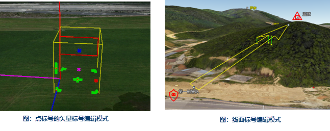

三维动态标绘主要用于结合电子地图实现军事作战方案、应急处置方案、公安围捕方案等指挥调度方案的三维图形标绘。通过使用三维图形标绘面板提供的各类具有特殊意义的图形、模型标号，可以在三维场景上非常直观、准确地展现事件的处置方案，提高应急事件处置过程中会商和沟通的效率。

三维动态标绘提供了遵照相关行业标准制作的标号库，能够完整地支持军事、公安和武警、应急等行业图形应用需求，警用图形标号库如下图所示。

  

图形标号能够在三维场景中被选中，进行移动、节点编辑等操作，实现图形交互式编辑。下图中为点、线面标号在场景中的编辑操作界面示意。

|   
---|---  
图：点标号的矢量标号编辑模式| 图：线面标号编辑模式  

关于图形标号的具体介绍，请参见：[查看与编辑图形标号](IntroduceMark)。

态势推演是三维标绘的一个重要功能，桌面产品中主要支持以下7类态势推演动画：

* **属性** ：按照设定的起始和终止状态，在指定时间内渐变，可以设置主线颜色，主线宽度，衬线颜色，衬线宽度等。
* **闪烁** ：按照设定标号的闪烁间隔，进行颜色切换闪烁或者显隐切换闪烁。
* **路径** ：标号按照设定的移动轨迹、方向，进行轨迹移动。
* **旋转** ：按照设定的时间、旋转起始角度、旋转终止角度，进行旋转。
* **比例** ：按照设定的时间，缩放指定的比例。
* **显隐** ：能够设置标号在一定时间内是否可见。
* **生长** ：能够设置标号的生长比例和生长时间，在指定时间内完成标号生长。

  

在SuperMap桌面产品中，新建或者打开一个球面场景，就会显示“三维标绘”选项卡，对此选项卡中的功能介绍如下：

[ 标绘面板](Introduce3DPlottingPanel)

用来显示常用标号、警用标号以及图元的符号面板，在CAD图层可编辑的情况下，可直接选中某一标号或图元进行绘制。

[属性面板](PropertyPanel_3D)

用来显示选中标号或图元的属性信息，支持直接对其属性进行修改。

[态势推演管理器](../AnimationManager)

用来制作支持的7类态势推演动画。
