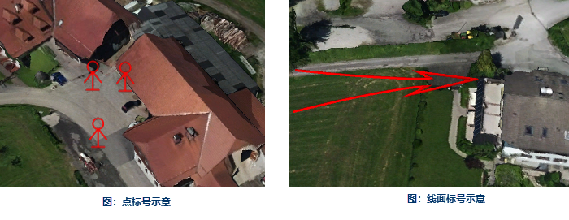
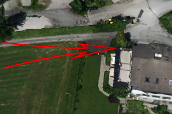

三维标绘面板中，提供了点标号、线面标号、图元在三维场景中的显示、绘制与编辑。

### 使用说明

三维标绘只支持在CAD图层上添加标号以及图元对象，而且CAD数据集的投影需为WGS 1984。

### 操作步骤

三维标号绘制的具体操作步骤如下：

  1. 新建CAD数据集并添加到对应场景窗口中，设置CAD图层为可编辑状态。
  2. 在“ **三维标绘** ”选项卡“ **标绘面板** ”组中，单击“ **标绘面板** ”，弹出“三维标绘面板”对话框。三维标绘面板分为“符号”和“图元”两个页面，“符号”中存放的是系统预定义的各类标号符号，“图元”中则是折线、平行四边形、圆、椭圆等常用的图形对象。
  3. 在场景中标绘标号。标绘面板中提供了两种类型的标号，一类是例如广场、门牌号、人员等点标号，另一类是例如单箭头、双箭头、多箭头等线面符号，在标绘面板中选中要绘制的标号，直接在场景中要标绘的位置点击，即可绘制标号，如下图中所示。  
  
 |   
---|---  
图：点标号示意 | 图：线面标号示意  
  
需要注意的是，线面标号绘制时，需要在点击多个位置。线面标号有两种结束方式，一种是绘制到最大点个数时，例如两个点的线面标号，当鼠标左键单击两个点时，标号绘制结束；一种是绘制未到最大点时，右键单击即可结束线面标号的绘制。

###  相关主题

 [三维标绘属性面板](PropertyPanel_3D.html)

 [态势推演管理器](../AnimationManager.html)

