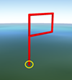
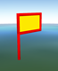

下文中将详细介绍点标号、线面标号以及文字注记的属性参数。

**点标号**

点标号在三维场景中支持四种显示模式：公告板模式、矢量标号模式、模型模式以及图片模式。下面详细列出点标号在三维场景中的四种显示模式以及其支持的属性。

表：点标号属性列表  属性 | 说明 | 公告板模式图示 | 矢量标号模式图示 | 模型模式图示 | 图片模式图示  
---|---|---|---|---|---  
定位点 | 点标号在地图上显示的定位坐标点，用经度、纬度、高度表示（x，y，z）。 |  | |  |  
标号大小 | 设置点标号宽度和高度，单位为0.1mm。 |  | 不支持 | 不支持 |不支持  
旋转角度 | 设置点标号绕自身局部坐标系的X，Y，Z各轴旋转的角度。 | 不支持 | 支持 | | 不支持  
缩放比例 | 设置点标号相对于原始标号缩放显示的比例值。 | 不支持 | 支持 | 支持 | 不支持  
模型ID | 在模型模式下设定点标号用到的模型在模型库中的ID。 | 不支持 | 不支持 | 支持 | 不支持  
线风格 | 点标号的线风格包括边线宽度、边线类型和边线颜色。注：矢量标号模式暂不支持修改线型。 | |  | 不支持 | 不支持  
填充风格 | 点标号闭合图形部分支持多种填充方式。注：矢量标号模式暂只支持实填充。 |  | | 不支持 | 不支持  
衬线 | 点标号的衬线风格包括衬线颜色、衬线宽度和衬线类型。衬线类型包括内衬、外衬、双衬。 | |  | 不支持 | 不支持  
文本内容 | 支持在点标号的上方或中间添加文本作为队号。注记的字体、大小、颜色、位置等均可以设定。 | |  | | 不支持  

**线面标号**

线面标号包括进攻箭头、钳击箭头、多箭头、集结地等标号，线面标号属性支持填充、衬线、子标号等显示特性，详细参数介绍请见下表。

表：线面标号属性列表  属性 | 说明 | 图示  
---|---|---  
线风格 | 线面标号的线风格包括设定边线宽度、边线颜色。 |   
填充风格 | 线面标号的填充风格包括设定填充模式、填充颜色、透明度、渐变角度等。 |   
衬线 | 线面标号的衬线风格包括衬线颜色、衬线宽度、衬线类型。衬线类型包括内衬、外衬、双衬。 |
  

**文字注记**

文字注记在三维场景中的详细参数介绍请见下表。

表：文字注记属性列表  属性 | 说明 | 图示  
---|---|---  
文字注记边框 | 设定文字注记是否显示边框。 |   
注记边框颜色 | 文字注记设置为显示边框时，可以设定边框颜色。 |   
定位点 | 支持标文字注记定位点坐标值的设定。 |   
文本风格 | 文本风格的设置包括字体名称、字体大小、字体颜色等。|  
注记高度 | 调整字体下方竖线的高度。 |   

### 相关主题

 [二维标绘属性面板](../2DPlotting/PropertyPanel_2D)

 [三维标绘属性面板](../3DPlotting/PropertyPanel_3D)

