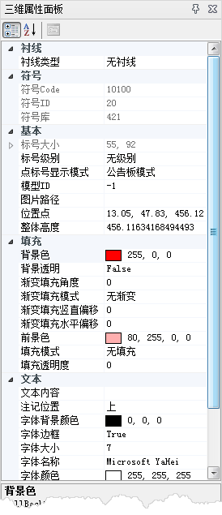
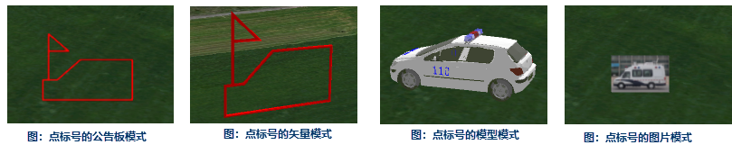

### 使用说明

三维标绘属性面板提供了点标号、线面标号以及图元的属性修改操作，例如标号大小、填充、线型、衬线等属性。具体操作步骤如下：

  1. 在“ **三维标绘** ”选项卡“ **标绘面板** ”组中，单击“ **属性面板** ”，弹出“三维属性面板”对话框。
  2. 选中一个点标号或者线面标号，可以在属性面板中查看、修改标号相应的属性。点标号、线面标号的属性参数，如下图所示。  
  
 
  
其中，三维场景中的点标号可以设置四种显示模式，分别如下图中所示：
  

点标号、线面标号的属性介绍，具体请查看：[二三维标号属性介绍](IntroduceMark)。

绘制在地图窗口的三维标号，除了可以选中修改其属性外，也可以直接在场景窗口中拖动鼠标进行编辑，具体请查看：[二三维标号的编辑](../EditPlotting)。

###  相关主题

 [三维标绘面板](Introduce3DPlottingPanel)

 [态势推演管理器](../AnimationManager)

