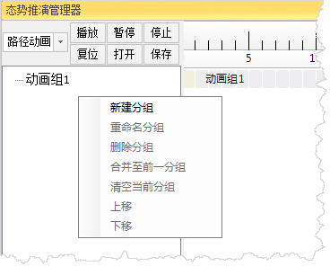

### 使用说明

使用" **态势推演管理器** "可以制作路径动画、闪烁动画、属性动画、显隐动画、旋转动画、比例动画和生长动画七种动画。

使用"态势推演管理器”制作动画的前提条件是：地图或者场景中存在标号,并且该标号处于选中状态。

### 操作步骤

1. 打开地图/场景，在"二维/三维标绘"选项卡“态势推演”组中单击“态势推演管理器”按钮，弹出“态势推演管理器”对话框。 
2. 新建动画组。在对话框左侧控件的空白处右键单击，弹出的菜单中选择 “新建分组”，新建一个动画分组。如下图中所示。 
  

选中一个已经创建的动画组后，弹出的右键菜单中的其他命令可用:

* 重命名分组：对动画组重新命名.
* 删除分组：删除动画组，包括其中已经包含的动画。 
* 合并至前一分组：可以将动画组中的动画移到上一个动画组中，并删除当前动画组。 
* 清空当前分组：清空动画组中的动画。 
* 上移：将动画组上移。 
* 下移：将动画组下移。 
3. 创建动画。选中场景中的标号，在左侧的下拉列表中，选择要创建的动画，例如路径动画，如下图中所示：   

  

在创建的动画上右键单击，弹出的右键菜单中的命令可用：

* 重命名动画：对动画重命名。 
* 删除动画：可以删除当前选中的动画。 
* 拆分为两组：以此动画为基础，将其所在的动画组拆分为两组。 
4. 修改动画属性。在“动画属性”标签页中，对选中的动画属性进行修改。 
  
    

**动画开始时间** ：修改动画的开始时间，有两种方式，一种是直接修改属性面板中的“动画开始时间”的值，另一种是左键单击动画对应的时间条，直接拖动修改。

**动画播放时长** ：修改动画的播放时长，有两种方式，一种是直接修改属性面板中的“动画播放时间”的值，另一种是右键单击动画对应的时间条，直接拖动修改。

除此之外,每种动画都有其专有的属性，分别介绍如下:

**路径动画**

* 切线方向：设置动画对象是否沿着切线方向行进。当点标号为矢量或者模型模式时，标号会沿着路径的角度自动切换对象正方向在的位置。 
* 显示路径：设置动画播放时是否显示路径动画的路径。 
* 路径类型：设置路径动画的路径是折线路径还是曲线路径。

除此之外，路径动画还需要设置路径点。选择“路径点管理” 标签页，具体的功能介绍如下:

* 添加按钮：在场景中适当的观测位置单击鼠标添加路径点，可以在下面的参数设置栏修改其经度、纬度、高度。 
* 编辑按钮：选中路径动画中的一个路径点，单击此按钮，即可在场景窗口中的合适位置再次单击鼠标，修改所选路径点的位置。
* 删除按钮： 选中一个路径点，可删除所选的单个路径点；选中路径结点，删除整个路径线。 

**闪烁动画**
* 闪烁方式：设置闪烁动画是按“频率闪烁”还是按“次数闪烁”。 
* 闪烁间隔(毫秒)：如果闪烁方式为“频率闪烁”，设置闪烁的频率间隔，单位为毫秒。 
* 闪烁次数：如果闪烁方式为“次数闪烁”，设置动画总共闪烁的次数。
* 颜色交替：设置闪烁动画有无颜色交替。 
* 交替颜色：如果闪烁动画有颜色交替，设置闪烁动画的交替颜色。 
* 交替起始颜色：如果闪烁动画有颜色交替，设置闪烁动画的起始交替颜色。 

**属性动画**

* 线色动画：设置线色动画是否有效。 
* 开始线颜色：如果线色动画有效，设置动画的开始线色。 
* 结束线颜色：如果线色动画有效，设置动画的结束线色。
* 线宽动画：设置线宽动画是否有效。 
* 开始线宽：如果线宽动画有效，设置动画的开始线宽。 
* 结束线宽：如果线宽动画有效，设置动画的结束线宽。 
* 衬线宽动画：设置衬线宽动画是否有效。 
* 开始衬线宽：如果衬线宽动画有效，设置开始衬线宽度。
* 结束衬线宽：如果衬线宽动画有效，设置结束衬线宽度。 
* 衬线颜色动画：设置衬线颜色动画是否有效。 
* 开始衬线色：如果衬线颜色动画有效，设置开始衬线颜色。 
* 结束衬线色：如果衬线颜色动画有效，设置结束衬线颜色。 

**显隐动画**

* 显示状态：设置显隐动画的最终状态。True表示标号的最终状态为显示，False表示标号的最终状态为不显示。 
* 显示效果：设置是否有渐变的效果。 

**旋转动画**

* 旋转方向：设置旋转动画是顺时针旋转还是逆时针旋转。 
* 开始旋转角度：设置X、Y、Z三轴的开始旋转角度。 
* 结束旋转角度：设置X、Y、Z三轴的结束旋转角度。 

**比例动画**

* 开始比例：设置比例动画的开始比例。 
* 结束比例：设置比例动画的结束比例。 

**生长动画**

* 开始比例：设置生长动画的开始比例。 
* 结束比例：设置生长动画的结束比例。 

各类标号具体支持的动画如下表中所示:

表：点、线面标号支持的动画说明  动画类型 | 点标号矢量模式 | 点标号公告板模式 | 点标号模型模式 | 线面标号  
---|---|---|---|---  
路径动画 |√|√|√|X  
闪烁动画 |√|√|√|√  
属性动画 |√|√|X|√  
显隐动画 |√|√|X|√  
旋转动画 |√|X|√|X  
比例动画 |√|√|√|X  
生长动画 |X|X|X|√  

5. 动画设置完成后，可以通过“播放”、“暂停”、“停止”和“复位”按钮实现动画的播放控制。 
6. 保存和打开动画。在动画制作完成后，可以点击“保存”按钮，将动画保存为XML文件。“打开”按钮可以将已有的保存动画的XML文件打开到态势推演管理器中，并支持对其属性进行修改。 

### 注意事项

1. 创建动画时，必须先要选中要创建动画的标号对象。
2. 动画播放是以动画组为单位的，即播放完一个动画组才会去播放下一个动画组。
3. 动画的开始时间是相对于动画组的。

### 相关主题

 [二维标绘](../Plotting/2DPlotting/2DPlotting)

 [三维标绘](../Plotting/3DPlotting/3DPlotting)
