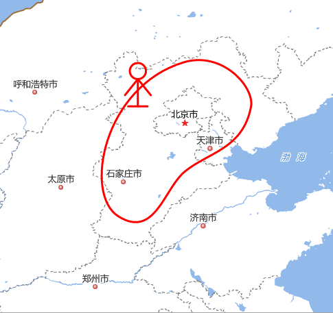
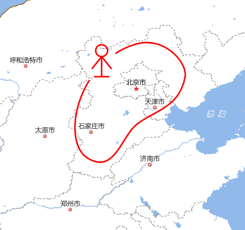

### 使用说明

使用" **避让区域** "可以为二维线面标号绘制避让、删除避让。

二维线面标号支持添加多个避让区域。

### 操作步骤

  1. 在地图窗口里，选中需要绘制避让区域的线面标号。 
  2. 点击"二维标绘"选项卡"下避让区域"组的"绘制避让"按钮，在选中的标号上需要添加避让的位置鼠标单击绘制避让区域，鼠标右键结束绘制，则避让区域被添加到标号中,避让添加前后效果见下图。   

 |   
|---|---  
图：避让添加前 | 图：避让添加后   
 
  3. 删除避让。选中要删除避让的线面标号，点击"二维标绘"选项卡下"避让区域"组的"删除避让"按钮，即可删除标号的避让区域。 

### 相关主题

 [二维标绘](../Plotting/2DPlotting/2DPlotting.html)

 [三维标绘](../Plotting/3DPlotting/3DPlotting.html)
