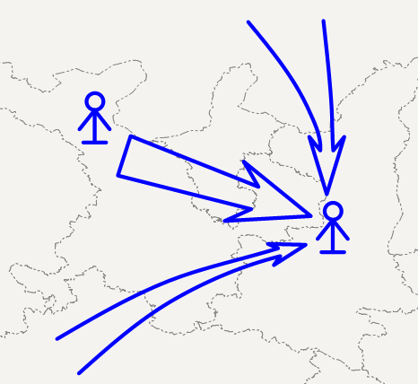

### 使用说明

使用" **标号缺省属性** "可以为点标号和线面标号设置默认属性，为点标号设置宽高、边线宽、边线颜色，为线面标号设置边线宽和边线颜色。

" **标号缺省属性** "提供"记录缺省属性"和"重置缺省属性"功能。

### 操作步骤

1. 缺省属性的使用方法二维标绘和三维标绘基本一致，这里以二维标绘为例展开说明。 
2. 打开地图，在"二维标绘"选项卡下可以看到"缺省属性"组，如下图所示。   

  
 
3. 在"缺省属性"组中，选中"记录缺省属性"前的复选框，记录当前为标号设置的默认属性并将应用到下次新创建的标号上。 
4. 在"缺省属性"组中，设置标号的默认属性，包括点标宽、点标高、边线宽、边线色等，设置结果如下图所示。   

  

5. 在标绘面板中选中要绘制的标号，直接在地图中要标绘的位置点击，即可绘制带有默认属性的标号，如下图中所示。  
 
  

6. 重置缺省属性。点击"二维标绘"选项卡下"缺省属性"组的"重置缺省属性"按钮，将当前系统中累计的默认属性清除，重新开始记录。 

### 相关主题

 [二维标绘](../Plotting/2DPlotting/2DPlotting)

 [三维标绘](../Plotting/3DPlotting/3DPlotting)
