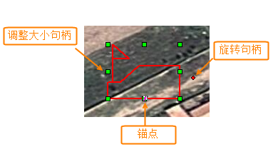
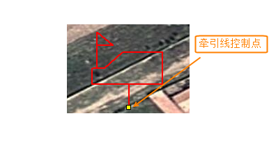
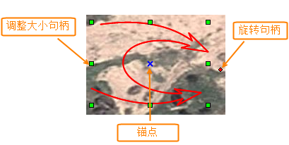
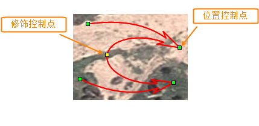
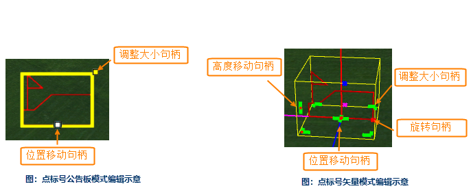
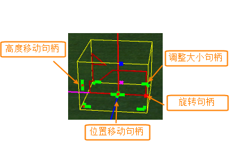
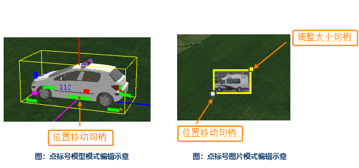
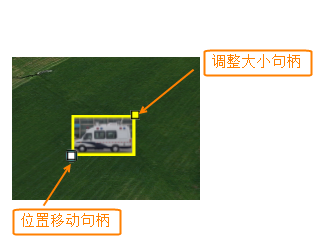
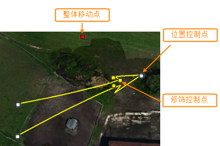

二三维标号的编辑，指的是在CAD图层可编辑的情况下，通过鼠标拖拽的方式，对地图或场景中的点标号、线面标号进行大小、位置等的改变。

### 使用说明

**二维标号的编辑**

**点标号的编辑**

选中点标号，其编辑状态如下图中所示。

  

  
鼠标拖拽“调整大小句柄”可以改变标号的大小；在“锚点”上拖拽，可以移动标号的位置；“旋转句柄”则可以对标号进行旋转。

选中点标号后，在“ **对象操作** ”选项卡“ **对象编辑** ”组中，选择“ **编辑节点** ”，可以修改点标号牵引线的位置，如下图中所示。

  

**线面标号的编辑**

选中线面标号，其编辑状态如下图中所示。

  

  
与点标号的编辑操作一样，鼠标拖拽“调整大小句柄”可以改变线面标号的大小；在“锚点”处拖拽，可以移动标号的位置；“旋转句柄”则可以对标号进行旋转。

选中线面标号后，在“ **对象操作** ”选项卡“ **对象编辑** ”组中，选择“ **编辑节点**”，可以修改线面标号单个修饰节点、箭头以及箭尾的位置，如下图中所示。

  

  

**三维标号的编辑**

**点标号的编辑**

点标号分为公告板模式、矢量模式、模型模式和图片模式四种模式，下图分别是这四种模式的编辑示意。

 |   
---|---  
图：点标号公告板模式编辑示意 | 图：点标号矢量模式编辑示意      

 |   
---|---  
图：点标号模型模式编辑示意 | 图：点标号图片模式编辑示意  
  
在点标号的四种模式中，鼠标拖拽“调整大小句柄”可以改变点标号的大小，“位置移动句柄”可以更改标号在场景中位置。点标号的矢量模式，“旋转句柄”可以对标号进行旋转操作，“高度移动句柄”则可以上下调整标号的高度；公告板模式和图片模式，可以通过按住Shift键鼠标点击“位置移动句柄”来抬高标号的高度。

对点标号四种显示模式的介绍，请参见：[三维标绘属性面板](3DPlotting/Introduce3DPlottingPanel)。

**线面标号的编辑**

场景中线面标号的编辑如下图中所示。

  
  
线面标号可以通过按住Shift键鼠标点击“位置控制点”来抬高标号的高度。“整体移动点”可以整体移动选中的线面标号，“修饰控制点”控制显示形状的细节特征，通过调整修饰控制点，可以改变线面标号的特征大小，例如进攻箭头的大小。

###  相关主题

[二维标绘属性面板](../Plotting/2DPlotting/PropertyPanel_2D)

 [态势推演管理器](../Plotting/AnimationManager)

