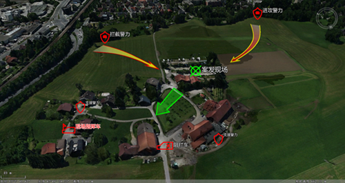
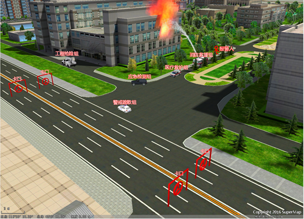

SuperMap
提供了二维、三维标绘技术，它是实现在超图底层平台的一项技术，可以构建二三维一体化标号库，方便灵活的标绘二维、三维点标号、线面标号，提供三维态势推演功能。主要应用于军事作战方案、应急处置方案、公安围捕方案等指挥调度方案中，结合三维场景进行图形标绘。通过提供的各类具有特殊意义的图形、模型标号，可以在三维场景上非常直观、准确地展现事件的处置方案，提高事件处置过程中会商和沟通的效率。

如下图中所示，是以倾斜摄影数据为背景的模拟反恐态势标绘，以及以精细模型数据为背景的工厂火灾应急处置模拟标绘。

  

  

  
因为二维、三维标绘技术的核心功能是在底层实现的，所以它能够支持SuperMap平台软件中的全系列产品。体现在SuperMap
iDesktop中，就是可以直接进行二维、三维标绘的编辑操作。

下面将分别对二维标绘、三维标绘功能进行介绍。

###  内容提要：

  [二维标绘](2DPlotting/2DPlotting.html)

  [三维标绘](3DPlotting/3DPlotting.html)
