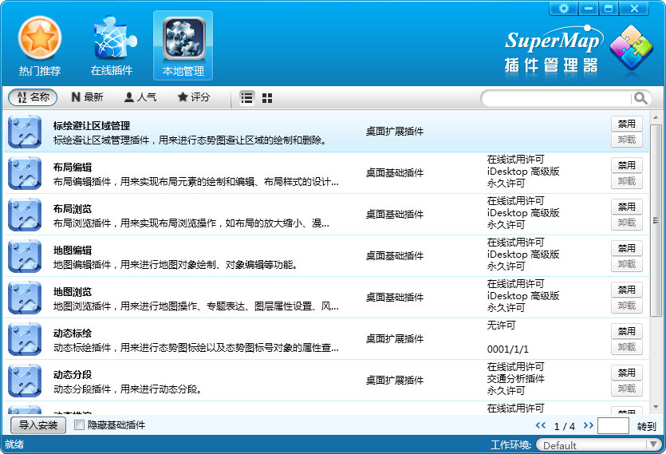
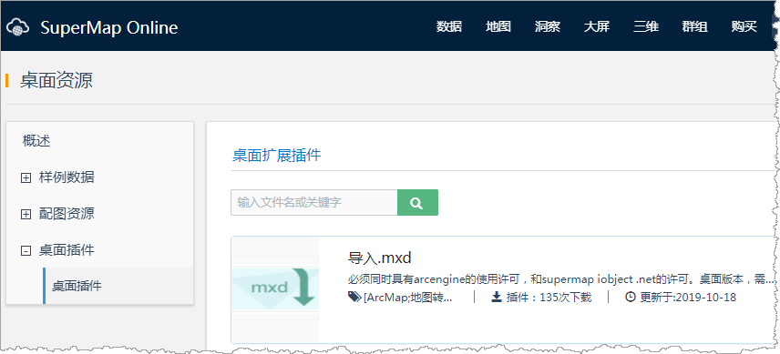

在 GIS 应用越来越深入的今天，使用灵活易用的插件，可以对 桌面的功能进行扩展，提高开发效率和应用速度。但随着插件的增多和更新速度的加快，插件的管理和共享存在难度，而且独立开发一款全新的插件成本较高。为了节约开发成本， 插件共享解决方案应运而生。桌面产品自带的插件管理器与 SuperMap Online 桌面插件管理配合使用，提供给用户一套完整的插件共享解决方案。

### 插件管理器

插件管理器是一款功能强大的管理工具，可以在客户端独立运行。在网络畅通的情况下，插件管理器可与在线网站进行交互，提供给用户强大的插件管理功能，其中涉及插件的搜索、管理、下载、导入等环节，从而实现不同用户间的插件共享。

  
 
  
### SuperMap Online 桌面插件管理

SuperMap Online 桌面插件主页是实现用户插件共享的网络门户，是汇集各类型插件的展示窗口，为用户提供一个插件下载的平台。您可直接输入网址
<https://www.supermapol.com/resources/datas> 进入SuperMap Online
桌面插件的主页。

  

  
### 相关主题

 [插件管理器](manager)

 [安装插件](Install)

 [下载插件](Download)

 [卸载/移除插件](Remove)

