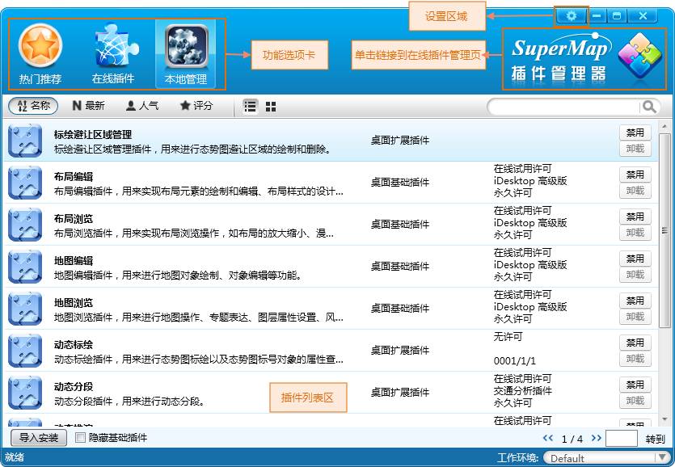

插件管理器是桌面产品提供的一款功能强大的管理工具，可以在客户端独立运行。插件管理器提供比较全面的插件管理功能和共享机制，可以对插件进行搜索、插件状态进行控制（启用、禁用、卸载）、插件下载。

### 启动插件管理器

在“ **视图** ”选项卡的“ **自定义** ”组中，单击“ **插件管理** ”按钮，进入插件管理主界面。

或者执行下列操作：在安装路径\Bin 目录下找到 SuperMap PluginManager.exe 可执行程序，双击即可启动。

  

### 插件管理器界面介绍

插件管理器的主界面如上图所示，界面简洁淡雅，功能选项卡完全取代了菜单和工具条的组织模式，将各种功能直观地呈现在用户面前，便于使用与查找。

* **功能选项卡** ：插件管理器提供的功能模块包括：热门推荐、在线插件、本地管理，通过切换不同的功能选项卡实现插件管理与共享。

* **热门推荐** ：在此选项卡列表中为用户显示出服务器上已发布的插件包，并且按照用户关注程度进行排序。
* **在线插件** ：在该选项卡目录中，用户可以查询到插件服务器上已经发布出来的插件，用户可以通过单击“下载”按钮将插件下载到本地。

  * **插件安装** : 是将已经下载到本地的插件包进行配置安装，安装后的插件才可以进行启用、禁用等操作。
  * **插件移除** : 是将已经下载到本地的插件包（尚未进行安装配置）删除。
* **本地管理** ：插件列表区域中显示了插件名称，介绍信息、评论数、得分情况、更新日期等。用户可以在插件列表区域对相应地插件进行操作，启用、禁用或者删除插件。 
  * **插件禁用** ：表示桌面应用程序在启动的时候，不会加载该插件。禁用插件的操作在插件列表中，单击“禁用”按钮即可，则在下次启动应用程序时该插件的功能被禁用。
  * **插件启用** ：该操作与禁用相反。在插件列表中单击“启用”即可，下次启动应用程序时会恢复启用该插件的功能。
  * **插件卸载** ：自动删除该插件对应的文件夹下的所有文件。在插件列表中单击“卸载”，此时程序会删除插件对应的动态库文件以及配置文件。注意此操作时不可恢复，请慎用。 

**备注：** 对于用户自定义的插件可以卸载，而系统自带的基础插件不能卸载，只能禁用。可以通入导入安装按钮导入本机的插件。

* **链接至SuperMap Online** ：在插件管理器的主界面上，单击框选区域可直接跳转至 SuperMap Online 桌面插件的主页。
* **设置区域** ：打开设置窗口后可以进行单页显示数量、插件文件目录、服务器地址的设置。
* **插件列表区域** ：插件列表区域列出了本地的插件或者插件库里面的插件资源。用户可以对本地插件进行管理，例如启用、禁用或者卸载插件，或者对插件库中的插件进行下载、发布和更新等。
* **插件搜索** ：支持对插件库里面的所有插件进行模糊搜索，方便用户查询感兴趣的插件。

**注意：** 在对插件进行管理时，需要先退出桌面应用程序，否则可能会由于用户使用插件，导致操作无效。

### 相关主题

 [插件管理](aboutpluginmanage)

 [安装插件](Install)

 [下载插件](Download)

 [卸载/移除插件](Remove)

