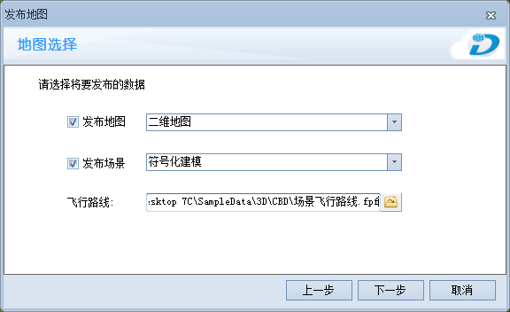
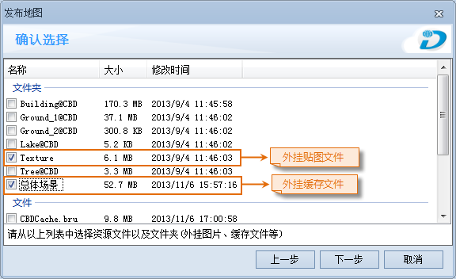

本专题文档主要通过一个发布地图实例，介绍如何使用  的发布地图功能将本地的地图数据发布到SuperMap在线商店中，实现资源共享。

应用实例的主要内容包括准备地图和场景、制作飞行路线、生成缓存文件、图片准备和发布数据几个部分。下面用示范数据中的CBDCache.smwu数据为基础，以“使用中的工作空间”方式为例，说明如何使用“发布地图”功能，将本地数据发布。

### 操作步骤

**第一步 准备地图和场景**

  1. 启动  应用程序。
  2. 单击应用程序左上角的文件按钮，在弹出的菜单中选择“示范数据”，直接打开右侧工作空间列表中的“CBD 场景数据(CBDCache.smwu)”，打开该数据。
  3. 将地图结点中的“二维地图”和场景结点下的“符号化建模”作为将要发布的地图和场景。

**第二步 制作飞行路线**

  1. 双击场景结点下的“符号化建模”，打开场景。
  2. 点击“飞行管理”选项卡中“飞行路线”组的“新建”按钮，在场景中添加飞行站点，制作飞行路线，具体制作步骤请参照[创建飞行路线](../SceneOperation/FlyManager/CreateRoutel)。
  3. 制作完飞行路线后，单击“飞行管理”选项卡中“文件管理”组的“保存”按钮，将飞行路线保存为“场景飞行路线.fpf”。

**第三步 生成缓存文件**

  1. 双击场景结点下的“总体场景”，打开场景。
  2. 当场景窗口中没有任何选中的对象时，在场景窗口中右键单击鼠标，在弹出的场景右键菜单中选择“生成场景缓存”命令。
  3. 在弹出的“生成整个场景缓存”对话框中，单击按钮，选中所有数据；单击“缓存用途”右侧下拉按钮，选择缓存类型，若需在 iMapReader 中查看缓存文件，需选择相应的“iOS 系列设备”或“android 系列设备”选项；并单击“缓存路径”右侧的“浏览”按钮，将场景缓存的输出路径设置为该工作空间所在的文件夹下，即“C:\Program Files\SuperMap\\SampleData\3D\CBD”。单击“生成”按钮，即可生成一个名为“总体缓存”的场景缓存文件。

**第四步 图片准备**

  1. 发布地图时需添加地图的Logo，图片文件格式可以为*.png、*.jpg、*.jpeg、*.bmp 。
  2. 发布外挂场景缓存数据时，为保证场景的现实效果，可将场景中的贴图一并发布，即把 Texture 文件夹中的贴图做为外挂图片发布。

**第五步 发布数据**

  1. 单击“开始”选项卡“账户”组中的“登录”按钮，登录已有的账号（在线商店或者地图汇账号）。
  2. 单击“工具”选项卡“制图与发布”组的“发布地图”按钮,通过保存提示对话框将地图、场景和工作空间都保存。
  3. 阅读发布地图的“免责声明”，并勾选“阅读并同意”，单击“下一步”按钮。
  4. 在选择数据对话框中勾选“使用中的工作空间”方式，单击下一步，分别选择“二维地图”和“符号化建模”为要发布的地图和场景，单击“飞行路线”右侧的按钮，添加第二步做好的“场景飞行路线.fpf”。
  
---  
图：地图选择对话框  
  5. 在“确认选择”对话框中，勾选“总体场景”缓存文件和“Texture”贴图做为外挂文件。    
---  
图：地图选择对话框  
  6. 在“描述信息”对话框中，单击左侧图片添加“Logo.png”作为图标，同时分别在标题、简介、详细信息文本框中输入相应的描述，单击“开始”按钮即可将数据发布至SuperMap在线商店。数据发布成功后，输出窗口中会提示：“发布成功，等待管理员审核。”。

### 注意事项

  * 用户在发布地图前，登录账号，也可以在发布地图过程中通过提示窗口登录。若用户只打包数据不发布，可不登录账号。
  * 若用户发布了外挂场景缓存文件，建议用户将此场景所用到的贴图以外挂的形式一并发布，因为生成的场景缓存文件中不包含贴图文件。
  * 若发布的场景缓存文件类型为 iOS 系列设备，则只在 iPad 中可用；若发布的场景缓存文件类型为 android 系列设备，则只在安卓设备中可用；若发布的场景缓存文件类型为普通 PC 设备，则只在 PC 机器中可用。

