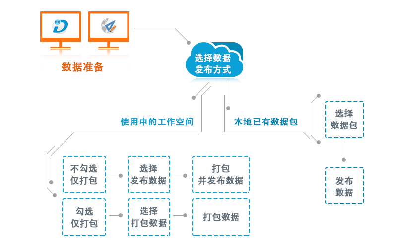
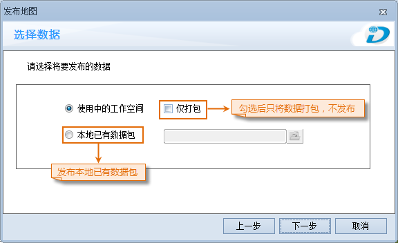
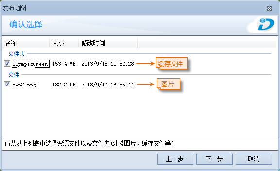
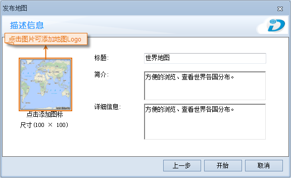
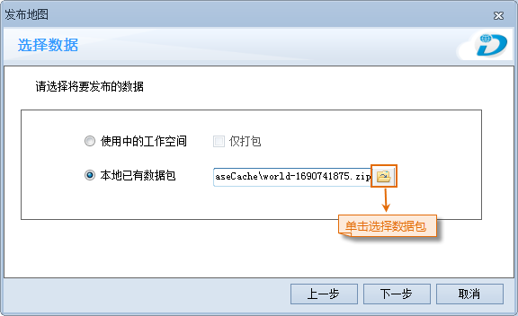
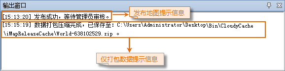

### 使用说明

“发布地图”功能选项，可以将工作空间中的地图发布 SuperMap “在线商店”网站上，以Web网络形式实现资源共享。发布地图时用户需登录SuperMap
“在线商店”或者“地图汇”的账户，若用户不登陆，则仅提供数据打包的功能，不能将数据发布。当发布的地图通过管理员审核后，用户即可在 SuperMap
“在线商店”，或者通过 iMapReader 下载、浏览发布的地图（此处的地图包括二维地图、场景，及与场景关联的飞行路线）。

发布地图流程如下图所示：

  
---  
图：发布地图流程图  
  
### 操作步骤

  1. 在“ **工具** ”选项卡的“ **制图与发布** ”组中，单击“ **发布地图** ”按钮，会弹出提示用户保存地图、布局、场景和工作空间等数据的对话框，将数据保存即可进行下一步操作。
  2. 若用户未登录，则会弹出“登录”窗口，如下图所示。用户在窗口中输入已有的账号和密码即可，未注册的用户可单击“注册账号”进行注册。若用户只想打包数据，可单击“跳过”按钮，进行下一步操作。
  3. 在弹出发布地图的“免责声明”窗口中，请用户阅读“免责声明”，确保数据的 **合法性** ，勾选窗口左下侧的“已阅读并同意”，即可进行下一步操作。 
  4. 单击上图窗口中的“下一步”按钮，弹出“选择数据”窗口，用户可勾选“使用中的工作空间”或者“本地已有的数据包”单选框。    
---  
图：数据选择窗口  
    * **使用中的工作空间：** 只选择“使用中的工作空间”单选框，可将工作空间的数据打包并且发布。若勾选了“ **仅打包** ”复选框后，此次操作不能发布数据，只能将数据打包供下次发布地图使用，或者通过 iMapReader 直接打开浏览打包好的数据。
    * **本地已有数据包：** 选择“本地已有数据包”单选框后，可在本地选择通过“仅打包”压缩的数据包，发布数据包中的数据。

选择发布数据方式不同，则操作方式有所不同，其中，勾选“仅打包”与选择“使用中的工作空间”操作步骤一致，但是结果有区别：前者只能将数据打包；后者将数据打包并发布。

使用中的工作空间

(1)
选择“使用中的工作空间”（或者同时勾选“仅打包”），单击窗口中的“下一步”按钮，弹出“地图选择”窗口，用户可选择要发布的地图或场景，选择发布场景时，可附带“飞行路线”。若工作空间中没有地图，则“发布地图”项不可选；若工作空间中没有场景，则“发布场景”和“飞行路线”项不可选。

  
---  
图：选择地图窗口  
  
(2) 单击上图窗口中的“下一步”按钮，弹出“确认选择”窗口，可在列表中选择 **与工作空间处于同级目录**
的文件以及文件夹（外挂贴图、飞行路线、符号库、缓存文件等），一并发布。

**注意：** 若发布的缓存文件中，使用了贴图文件，需将贴图文件放至工作空间同级目录下，并将其勾选一并发布，才能确保发布的缓存文件正常使用。

  
---  
图：选择外挂文件窗口  
  
(3)
单击上图窗口中的“下一步”按钮，弹出“描述信息”窗口，用户可点击窗口左侧图片，添加地图Logo；同时，可输入发布地图的标题、简介和详细信息的内容，单击“开始”按钮即可打包及上传地图。

  
---  
图：描述信息窗口  
  
本地已有数据包

(1) 选择“本地已有数据包”单选框，点击按钮，选择一个通过“仅打包”功能打包好的数据包，单击“下一步”即可。

  
---  
图：选择数据包  
  
(2) 在后两步操作中，用户不需要选择地图并添加描述，地图与描述信息在打包数据时都已设定。单击“开始”按钮，即可将数据包发布。

  5. 地图发布成功后，“输出窗口”处会出现“发布成功，等待管理员审核。”的提示信息；若数据仅打包，打包成功后，输出窗口会提示数据包的保存路径及名称。如下图所示：    
---  
图：输出窗口提示信息  
  6. 地图发布成功后，可在在线商店登录后，在个人中心→我的上传中，查看地图的审核状态。若发布的地图审核未通过，请查阅注册邮箱的邮件，管理员会在邮件中注明未通过的原因；若发布的地图审核通过，管理员也会发送邮件通知，用户即可在 SuperMap 在线商店→地图处下载数据。

### 注意事项

  * 用户在发布地图前登录“地图汇”或者“在线商店”的账号；也可以在发布地图过程中通过提示窗口登录。
  * 若在“选择数据”窗口处勾选了“本地已有数据包”单选框，选择的数据包需是通过“发布地图”中的“仅打包”功能打包出来的数据包。

### 动画演示

“发布地图”动画演示

  

