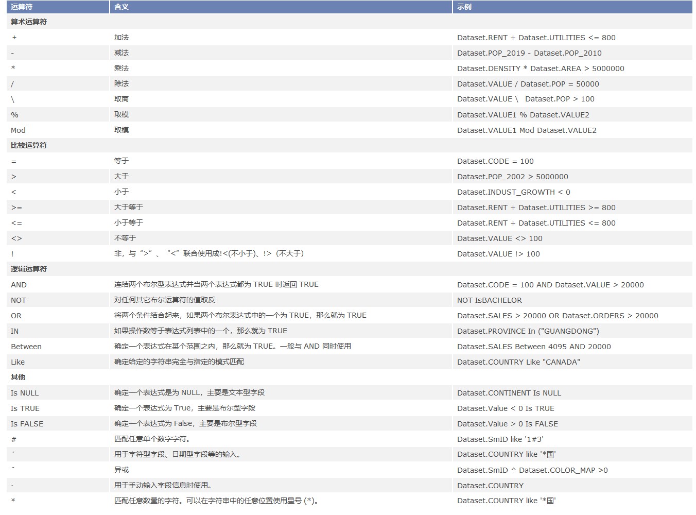
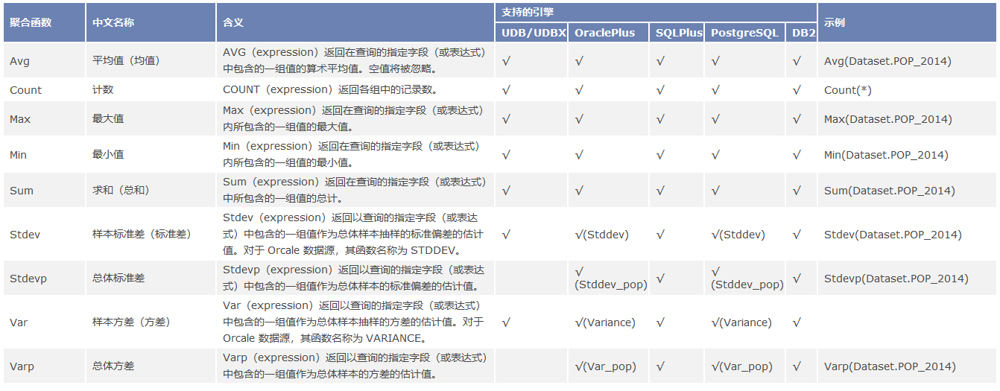
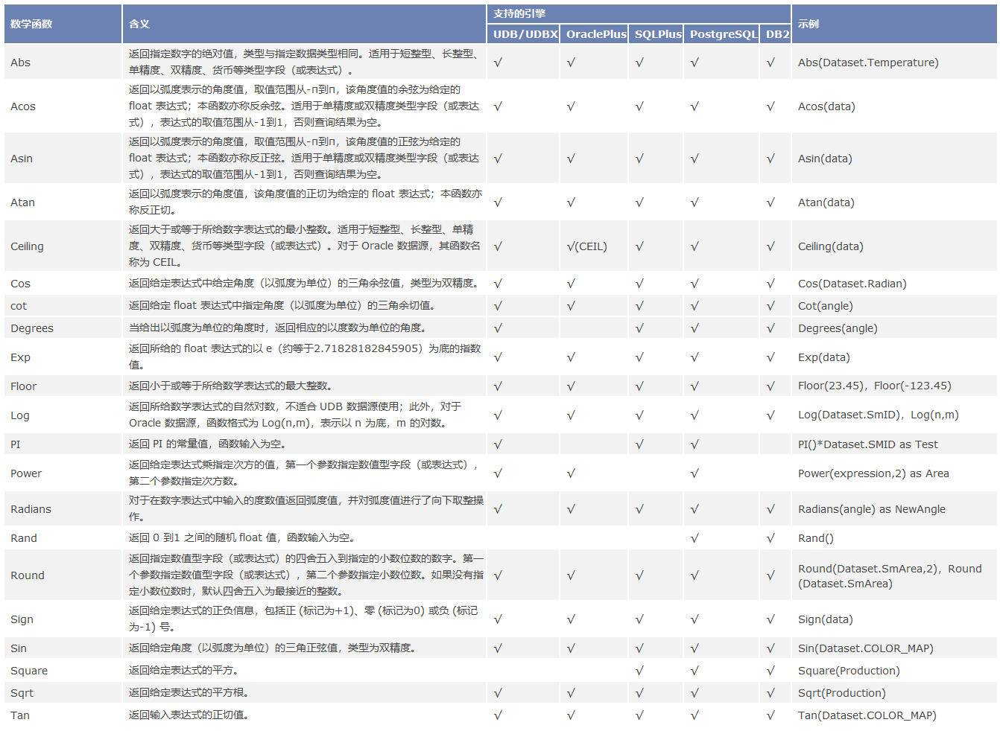
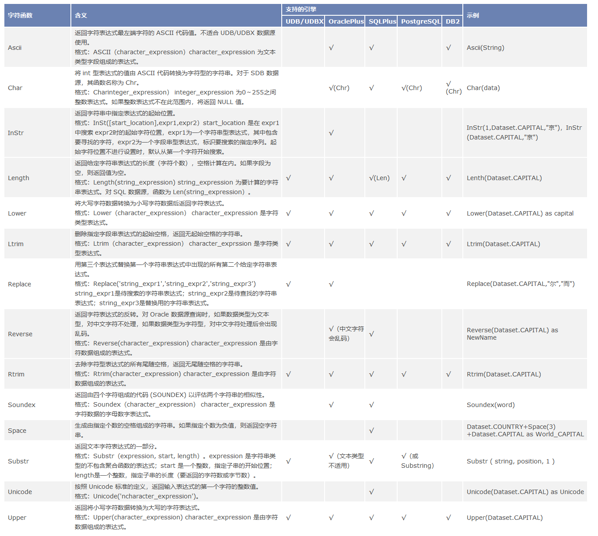
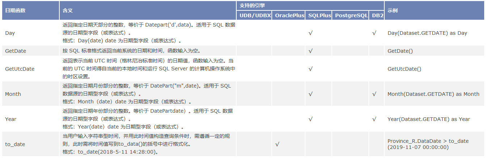

###  使用说明

SQL查询通过构建查询函数，实现从已有的数据中查询出满足特定条件的数据，这里的条件是通过对数据集属性通过运算符和常用函数实现查询。构建查询语句的常用函数包括聚合函数、数学函数、字符函数及日期函数。对于不同引擎的数据源，不同函数的适用情况及函数用法有所不同，在此也给出SQL查询功能对不同引擎支持情况。

### 运算符号

运算符号用于构造 SQL 查询条件，包括常用的数学运算符、逻辑运算符和一些比较特殊的运算符。  

  

  
### 聚合函数

聚合函数对一组值执行计算并得到单一的值。除 COUNT 函数之外，聚合函数忽略空值。聚合函数经常与 SELECT 语句的 GROUP BY
子句一同使用。所有聚合函数都具有确定性。任何时候用一组给定的输入值调用它们时，都得到相同的值。除 COUNT
函数外，其它聚合函数均不能对文本数据类型使用。在 SuperMap 中聚合函数中的表达式一般采用属性表的字段名。 **注意：**
聚合函数仅适用于属性表数据集。

    
  
### 数学函数

数学函数对数字表达式进行数学运算并返回运算结果。数学函数在 SuperMap 中的表达式一般采用属性表的字段名或其表达式，如
Cos(Slope）、Ceiling(Pop/Area）等。

  
  
### 字符函数

字符串函数用于对字符和二进制字符串进行各种操作，它们返回对字符数据进行操作时通常所需要的值。

  
  
### 日期函数

日期函数用来查询关于日期的信息。这些函数适用于日期类型字段值，并对这些值执行算术运算。可将日期函数用于可使用表达式的任何地方。  

    
  
**表格：datepart 参数设置**

设置 | 说明  
---|---  
yyyy | 年  
q | 季度  
m | 月  
y | 某年的某一天  
d | 天  
w | 工作日  
ww | 周  
h | 时  
n | 分  
s | 秒  
  
###  相关主题

 [SQL查询分组统计](SQLQuery_Group)

 [SQL查询常用表达式](SQLQuery_Expression)

 [SQL查询属性查询示例](SQLQuery_Example)

 [SQL关联查询示例](SQLQuery_Related)

