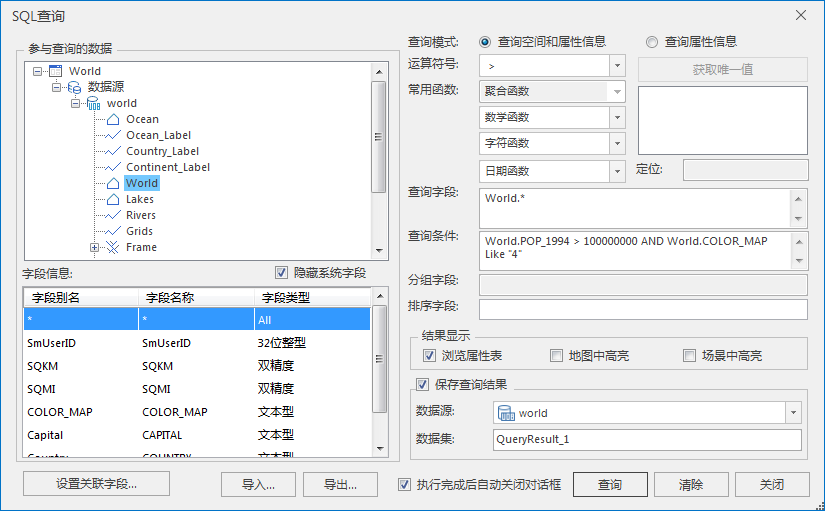
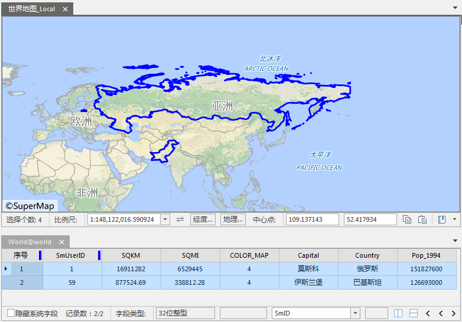

本文以查询1994年人口多于1亿及地图颜色为绿色(4)的国家分布为例说明如何进行属性查询。

第一步，打开世界数据工作空间：World.smwu，查询数据集为 World。

第二步，选择“ **空间分析** ”选项卡 > “ **查询** ”组中的“ **SQL 查询** ”，弹出“SQL 查询”对话框。

第三步，在“SQL 查询”对话框中做如下设置：查询模式：查询空间和属性信息；查询字段 World.*；查询条件 World.POP_1994 >
100000000 AND World.COLOR_MAP Like "4"；结果显示中勾选地图中高亮；保存查询结果。如下图：

  
---  
  
第四步，浏览查询结果。

地图窗口会自动切换成“关联浏览”模式，并列显示世界地图和查询结果的属性表；同时，查询结果会高亮显示在世界地图中，选择属性表中某一个国家，则地图窗口会自动定位到该国家，如下图所示。

  
---  
  
### 备注

  1. 已知存储各个国家地图颜色的字段为 World.COLOR_MAP，存储1994年人口信息的字段为 World.POP_1994，并且两个条件同时发挥作用，用 AND 连接。
  2. 查询时，“参与查询的数据”列表框中选中的数据集需要为本次查询的数据集，否则应用程序会提示查询失败。
  3. 如果我们在结果属性表中选择了一条记录后，相应的几何对象没有在地图窗口中高亮显示出来，这可能是由于我们在制作地图时，为了美观而设置了图层的可见比例尺范围。这个时候需要首先清除图层的可见比例尺范围的设置，操作方法参见：[设置可见比例尺范围](../Visualization/AdvanceSetting/ScaleRanges.htm)。

