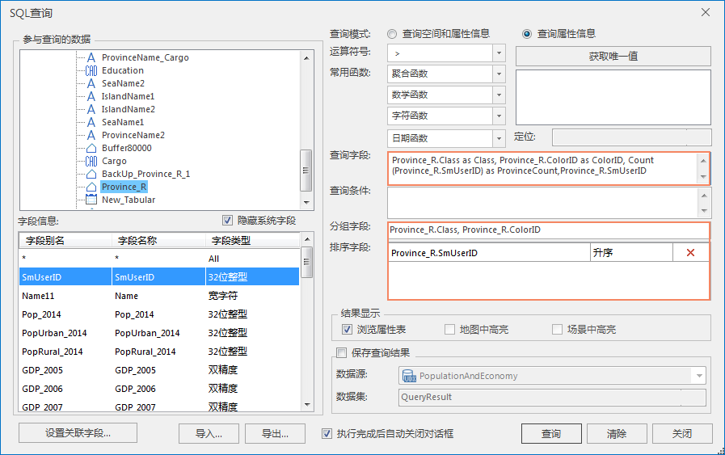
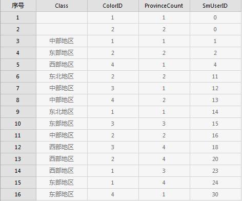

SuperMap 中的 SQL
查询功能除了可以进行一般的属性查询外，还可以根据指定的某个（或多个）字段将查询结果进行分组，使指定字段上有相同值的记录分在一组，再通过聚合函数、数学函数等函数对查询结果进行统计计算而得到新的临时字段结果，当然，得到的统计结果字段同时也是上述的派生字段。

### 对单个字段进行统计

下面以示范数据中的PopulationAndEconomy数据源中的Province_R数据为例，对我国的东部、西部、中部、东北部地区的省份数量进行统计。

  1. 打开数据所在的工作空间或者数据源，查询数据集为 Province_R。通过SQL查询的功能入口打开 **SQL 查询** 对话框。
  2. 在对话框中进行如下设置： 

查询模式：查询属性信息；

查询字段 Province_R.Class, Count(Province_R.SmID) as ProvinceClassCount；

分组字段 Province_R.Class。

如下图：

  
---  
  
这样就可以对每个区域进行统计，统计的是各区域的省份数量（Count(Province_R.SmID)
）。此处我们为派生的统计字段指定了别名，在原字段表达式后键入空格，再加上“as”和别名即可：（Count(Province_R.SmID) as
ProvinceClassCount）。下图显示了统计得到的结果：

  
---  

### 对多个字段进行统计

除了可以对单个字段进行统计外，还可以根据情况对多个字段进行分组统计。用户只需要在分组字段编辑框中输入想要分组的多个字段及统计信息，应用程序会首先按照输入的第一个字段对属性表进行分组，然后在所分出的组内，再按第二个字段分组，依此类推，最后得到的所需查询表中每个记录都包含基于统计函数得到的派生字段的值。

下面仍以示范数据中的PopulationAndEconomy数据源中的Province_R数据为例，对各地区省份数量按照地图的颜色（Province_R.COLORID
字段值）进行统计。

  1. 打开数据所在的工作空间或数据源，查询数据集为 Province_R。
  2. 选择“ **空间分析** ”选项卡 > “ **查询** ”组中的“ **SQL 查询** ”，弹出“SQL查询”对话框。
  3. 在“SQL 查询”对话框中做如下设置： 

查询模式：查询属性信息；

查询字段 Province_R.Class as Class, Province_R.ColorID as ColorID,
Count(Province_R.SmUserID) as ProvinceCount,Province_R.SmUserID；

分组字段 Province_R.Class, Province_R.COLORID；

排序字段 Province_R.SmUserID。

如下图：

  
---  
  
这样就可以我国各地区的数量按照地图颜色进行统计，并按 SmUserID 字段进行升序排序。下图显示了统计得到的结果：

  
---  

