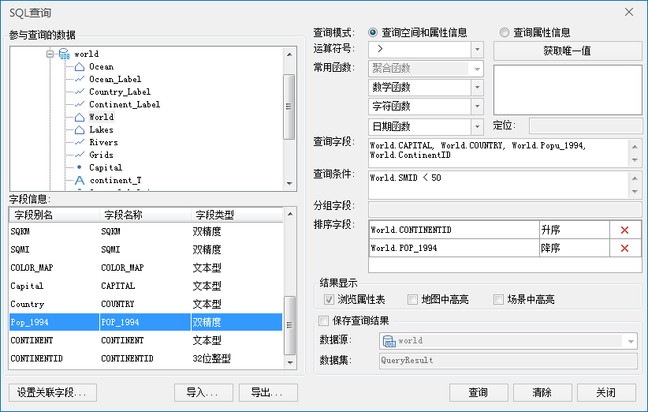
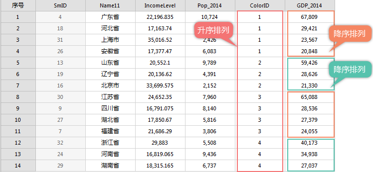

SuperMap SQL
查询功能除了能查询空间和属性信息外，同时还能对查询结果按照多个字段进行排序。当指定了排序字段后，查询结果会按照指定字段进行排序。当指定多个排序字段时，系统首先按第一个字段对记录排序，第一个字段有相同值的记录，就按其第二个字段的值进行排序，依此类推，最后得到按照这个顺序排列的查询结果。

下面以世界地图数据为例，查找 GDP_2014>50 的国家的属性信息，要求查询结果按照大洲ID升序排列，并按照各个国家的人口数量降序排列。

  1. 打开世界数据工作空间：World.smwu，查询数据集为 World。 
  2. 选择“ **空间分析** ”选项卡 > “ **查询** ”组中的“ **SQL 查询** ”，弹出“SQL 查询”对话框。
  3. 在“SQL查询”对话框中做如下设置： 

查询模式：查询属性信息；

查询字段为Province_R.Name,Province_R.IncomeLevel,Province_R.Pop_2014,Province_R.ColorID,Province_R.GDP_2014；

查询条件为 Province_R.GDP_2014 > 20000；

排序字段1为 Province_R.ColorID（按照升序排列），排序字段2为 Province_R.GDP_2014（按照降序排列）。

具体如下图所示：

  

  
可以查询出 Province_R.GDP_2014 > 20000
的所有省份的信息，名称、人均收入、人口、颜色ID。由于我们使用了排序字段，查询结果会按照第一个排序字段（Province_R.ColorID）指定的顺序（升序）先进行排序。由于第一个字段中有相同值的记录，然后按第二个排序字段（Province_R.GDP_2014）指定的顺序（降序）进行排序
。下图显示了按照ColorID和GDP排序得到的结果：  
    
