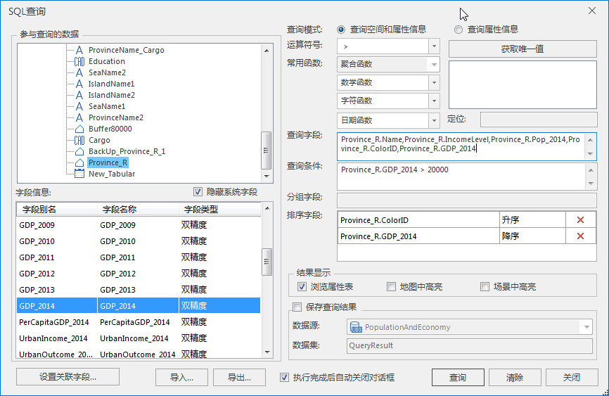

SuperMap SQL 查询功能除了能查询空间和属性信息外，同时还能对查询结果按照多个字段进行排序。当指定了排序字段后，查询结果会按照指定字段进行排序。当指定多个排序字段时，系统首先按第一个字段对记录排序，第一个字段有相同值的记录，就按其第二个字段的值进行排序，依此类推，最后得到按照这个顺序排列的查询结果。

下面以世界地图数据为例，查找 SmID<50 的国家的属性信息，要求查询结果按照大洲ID升序排列，并按照各个国家的人口数量降序排列。

  1. 打开世界数据工作空间：World.smwu，查询数据集为 World。 
  2. 选择“空间分析”选项卡 > “查询”组中的“SQL 查询”，弹出“SQL 查询”对话框。 
  3. 在“SQL查询”对话框中做如下设置：  

查询模式：查询属性信息；

查询字段为 World.CAPITAL, World.COUNTRY, World.Popu_1994, World.ContinentID；

查询条件为 World.SMID < 50；

排序字段1为 World.ContinentID（按照升序排列），排序字段2为 World.Popu_1994（按照降序排列）。

具体如下图所示： 

  

这样就可以查询出 SmID<50 的所有国家的信息，国家名称、首都、人口、所在大洲ID。由于我们使用了排序字段，查询结果会按照第一个排序字段（World.ContinentID）指定的顺序（升序）先进行排序。由于第一个字段中有相同值的记录，然后按第二个排序字段（World.Popu_1994）指定的顺序（降序）进行排序 。下图显示了按照大洲ID和人口排序得到的结果：     
  
    

