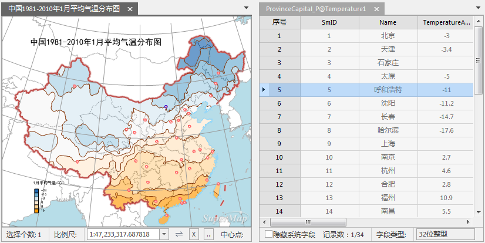

本文以查询存储在不同数据集中的深灰城市7月份的平均气温为例，说明如何进行连接表设置，实现不同数据集间的关联查询。

### 数据简要介绍

(1)在 Temperature_July_P
数据集中有各城市气象站点7月份的平均气温数据(TemperatureAverage)，气象站点名称(Name)包括省会城市的名称。

(2) 在 ProvinceCapital_P 数据集中有省会城市(Name)。

### 思路介绍：

通过省会城市名称字段，关联 Temperature_July_P 数据集，查询出省会城市7月份的平均气温信息，生成新的数据集。

### 示例实现：

第一步，打开示范数据工作空间：Temperature.smwu，打开 **中国1981-2010年1月平均气温分布图** 。

第二步，单击 **空间分析** -> **查询** -> **SQL 查询** 按钮，弹出"SQL查询"对话框。

第三步，设置“参与查询的数据”为 ProvinceCapital_P 数据集，单击对话框左下方的“设置关联字段...”按钮，打开“连接表设置”对话框。

第四步，在“连接表设置”对话框中进行如下设置：外接表 Temperature_July_P，本表字段 Name，外接表字段
Name，连接方式左连接。设置好之后， **SQL查询** 对话框，在“字段信息”中添加了关联数据集的字段信息，如下图：

  
---  
  
第五步，"SQL查询"对话框中的其他参数设置如下：

  * **查询模式** ：查询空间和属性信息；
  * **查询字段** ：ProvinceCapital_P.Name,Temperature_Jan_P.TemperatureAverage as TemperatureAverage_Jan；
  * 查询条件不进行设置，表示无条件；
  * 结果显示区中勾选 **地图中高亮** ；
  * **保存查询结果** ：设置所要保存的数据源和数据集名称。

如下图：

  
---  
  
第六步，浏览查询结果。

查询结果是与ProvinceCapital_P同类型的数据集（点数据集），其属性表中存储省会名称和一月份的平均气温，以及系统字段（以 Sm 打头的字段）。

地图窗口会自动切换成“关联浏览”模式，并列显示未命名地图和查询结果的属性表；同时，查询结果会高亮显示在未命名地图中，选择属性表中某一个城市，则地图窗口会自动定位到该城市。如下图所示：

  
---  
  
### 备注

  1. **连接类型：**

“连接表设置”中，连接类型为左连接时，结果记录数与 ProvinceCapital_P 数据集相同，不论 Temperature_Jan_P
数据集中是否有匹配的记录信息。有匹配的记录，给出 Temperature_Jan_P
中的字段信息，否则为空。如图中的石家庄和上海，没有平均气温，但出现在查询结果中，平均气温字段为空。

连接类型为内连接时，结果记录数等于 ProvinceCapital_P 与 Temperature_Jan_P
数据集完全匹配的记录数。查询结果就会去除没有平均气温信息的记录。

示例如下表所示：

**源数据集属性表** | **关联数据集属性表** | **“左连接”查询结果属性表** | **“内连接”查询结果属性表**  
---|---|---|---  
| 本表字段 | 字段2  
---|---  
1 | 1A  
2 | 2B  
3 | 3C  
4 | 4D  
| 外接表字段 | 字段3  
---|---  
1 | 10  
2 | 20  
3 | 30  
5 | 50  
| 关联字段 | 字段2 | 字段3  
---|---|---  
1 | 1A | 10  
2 | 2B | 20  
3 | 3C | 30  
4 | 4D |  
| 关联字段 | 字段2 | 字段3  
---|---|---  
1 | 1A | 10  
2 | 2B | 20  
3 | 3C | 30  
|  |  
  2. **关联字段：**

“连接表设置”中，本表字段不唯一时，即源数据集中有多条记录的“本表字段”值相同，则查询结果保留源数据集中的多条记录，对应于外接表中的同一记录。如源数据集为国家各省信息，外接表为国家信息，就会出现多个省对应一个国家，即“多对一”的情况，但是有意义的。

“连接表设置”中，外接表字段不唯一时，即关联数据集中有多条记录的“外接表字段”值相同，则查询结果保留关联数据集中对应“本表字段”的最后一个记录。

为保证使用的正确性和预见性，建议关联字段在关联数据集具有唯一性，才能保证一一对应。

