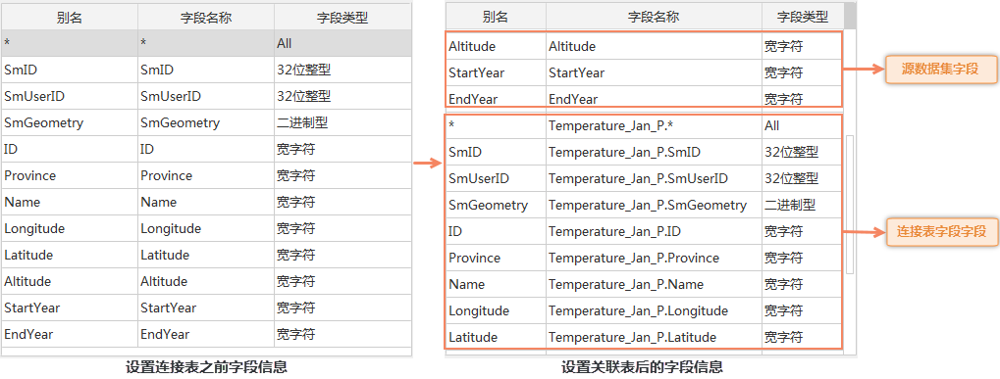

---
id: SQLQuery_Related
title: SQL关联查询实例
---  

本文以查询存储在不同数据集中的国家和国家人口，首都和首都人口为例说明如何进行连接表设置，实现不同数据集间的关联查询。

### 数据简要介绍:

(1) 在 World 数据集中有首都（Capital），国家（Country），国家人口（Pop_1994）等信息。

(2) 在 capitals 数据集中有首都（Capital_CH），首都人口（Pop）等信息。

### 思路介绍:

通过首都字段，关联 World 和 capitals 数据集，查询出国家和国家人口、首都和首都人口信息，包括没有首都记录的国家，生成新的数据集。

### 示例实现：

第一步，打开示范数据世界数据工作空间：World.smwu，打开 World 数据集，添加到新的地图窗口。

第二步，选择“**空间分析**”选项卡 > “**查询**”组中的“**SQL 查询**”，弹出"**SQL查询**"对话框。

第三步，设置“参与查询的数据”为 World 数据集，单击对话框左下方的“设置关联字段...”按钮，打开“连接表设置”对话框。

第四步，在“连接表设置”对话框中进行如下设置：外接表 Capitals，本表字段 Capital，外接表字段 Capital_CH，连接方式左连接，如下图：

  
  
单击“确定”按钮，关闭“连接表设置”对话框。返回到"SQL查询"对话框，在“字段信息”中添加了关联数据集的字段信息，如下图：

   
  
第五步，"SQL查询"对话框中的其他参数设置如下：查询模式：查询空间和属性信息；查询字段 World.COUNTRY as 国家, World.POP_1994 as 国家人口, capitals.CAPITAL_CH as 首都, capitals.POP as 首都人口；查询条件不进行设置，表示无条件；结果显示区中勾选地图中高亮；保存查询结果。如下图：

  

第六步，浏览查询结果。

查询结果（QueryResult）是与 World 同类型的数据集（面数据集），其属性表中存储国家和国家人口，首都和首都人口信息，以及系统字段（以 Sm 打头的字段）。

地图窗口会自动切换成“关联浏览”模式，并列显示未命名地图和查询结果的属性表；同时，查询结果会高亮显示在未命名地图中，选择属性表中某一个国家，则地图窗口会自动定位到该国家。如下图所示：

  

  
### 备注

  1. **连接类型：**

“连接表设置”中，连接类型为左连接时，结果记录数与 World 数据集相同，不论 capitals 数据集中是否有匹配的记录信息。有匹配的记录，给出 capitals 中的字段信息，否则为空。如图中的“阿拉伯区”，没有首都信息，但出现在查询结果中，首都，首都人口字段为空。

连接类型为内连接时，结果记录数等于 World 与 capitals 数据集完全匹配的记录数。查询结果就会去除没有首都信息的记录。

示例如下表所示：

**源数据集属性表**   

本表字段  | 字段2  
---|---  
1 | 1A  
2 | 2B  
3 | 3C  
4 | 4D    

**关联数据集属性表**  

外接表字段  | 字段3  
---|---  
1 | 10  
2 | 20  
3 | 30  
5 | 50  

 **“左连接”查询结果属性表**  

关联字段 | 字段 2 | 字段3  
---|---|---  
1 | 1A | 10  
2 | 2B | 20  
3 | 3C | 30  
4 | 4D |   

**“内连接”查询结果属性表**  

关联字段 | 字段2 | 字段3  
---|---|---  
1 | 1A | 10  
2 | 2B | 20  
3 | 3C | 30  

  2. **关联字段：**

“连接表设置”中，本表字段不唯一时，即源数据集中有多条记录的“本表字段”值相同，则查询结果保留源数据集中的多条记录，对应于外接表中的同一记录。如源数据集为国家各省信息，外接表为国家信息，就会出现多个省对应一个国家，即“多对一”的情况，但是有意义的。

“连接表设置”中，外接表字段不唯一时，即关联数据集中有多条记录的“外接表字段”值相同，则查询结果保留关联数据集中对应“本表字段”的最后一个记录。

为保证使用的正确性和预见性，建议关联字段在关联数据集具有唯一性，才能保证一一对应。
