　空间查询是通过几何对象之间的空间位置关系来构建过滤条件的一种查询方式。应用程序目前支持 8 种空间查询的基本算子，包括：交叉、包含、被包含、重叠、分离、邻接、重合、相交。

 空间查询涉及三个要素，分别为：搜索对象、被搜索图层及结果记录集。对各算子的图示中表达了所有空间查询的搜索对象和结果记录集，其中搜索对象用绿色表示，被搜索图层中的对象用黑色表示，结果记录集中的几何对象用红色表示。

### 交叉  
  
返回被搜索图层（线、面、CAD）中与搜索对象（线）交叉的所有对象。

-  基本关系：搜索对象（A）穿越被搜索对象（B）。   
-  线查线：A 从 B 内部的一侧进入并在 B 内部的某处另一侧穿出。A 的内部与 B 的内部交集不为空，且拓扑维数为0维。   
-  线查面：A 的内部与B的内部的交集不为空；A 的内部与B的外部的交集不为空。
  
**交叉算子详细说明:**  

空间查询条件 | 查询关系 |图示| 说明     
 :----- | :---: | :----: | :----:   
交叉_线线| 线查线|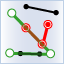| 线穿越线，从一侧进入，内部某处另一侧穿出，且内部交集只能是点。   
交叉_线面| 线查面|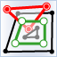| 线穿越面，线的两个端点至少有一个在面的外部。 

### 包含  
  
返回被搜索图层（点、线、面、文本、CAD）中搜索对象（点、线、面）所包含的对象。（不一定要完全包含，边界有交集也可以。）

-  基本关系：搜索对象（A）包含被搜索对象（B）（A、B边界交集可以不为空）。   
-  A 的外部与 B 的内部的交集为空，且内部交集不为空或 A 的边界与 B 内部无交集。 
-  A的维数 >= B 的维数。 
  
**包含算子详细说明:**  

空间查询条件 | 查询关系 |图示| 说明     
 :----- | :---: | :----: | :----:   
包含_点点 |点查点 | | 点重合。  
包含_点文本| 点查文本| |点与文本重合。   
包含_线点 |线查点 |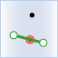 |线A包含点B，B在A上，包括在线A的端点上。  
包含_线线 |线查线 |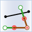|线 A 包含线 B，B 的端点可以与A的端点重合。   
包含_线文本| 线查文本|  |线A包含文本B，B在A上，包括在线A的端点上。 
包含_面点| 面查点| 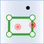 |面 A 包含点 B，B 可以在 A 的内部或边界上。 
包含_面线| 面查线| 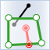 |面A包含线B，B 的端点可以在A的边界上。 
包含_面面| 面查面| |面 A 包含面 B，B 的边界可以与A的边界重合。 
包含_面文本| 面查文本|  |面 A 包含文本 B，B 可以在 A 的内部或边界上。 

### 被包含  
  
返回被搜索图层（点、线、面、CAD）中包含搜索对象（点、线、面）的对象。如果返回的对象是面，其必须包含（包括在边界上）搜索对象；如果返回的对象是线，其必须完全包含搜索对象；如果返回的对象是点，其必须在搜索对象上。

-  基本关系：被搜索图层（B）中包含搜索对象（A）。被包含是包含的逆算子。
  
**被包含算子详细说明:**  

空间查询条件 | 查询关系 |图示| 说明     
 :----- | :---: | :----: | :----:   
被包含_点点 |点查点|   |点重合。 
被包含_点线 |点查线|   |点A被线B包含，A可以与B的端点重合。    
被包含_点面 |点查面|  |点A被面B包含，A可以在B的内部或边界上。
被包含_线线 |线查线|   |线A被线B包含，A的端点可以与B的端点重合。 
被包含_线面 |线查面|   |线A被面B包含，A可以在B的内部或边界上。   
被包含_线面 |面查面|   |面A被面B包含，A的边界可以与B的边界重合。 

### 叠加  
  
返回被搜索图层（线、面、CAD）中与搜索对象（线、面）部分重叠的对象。

- 基本关系：搜索对象（A）与被搜索对象（B）交叠。   
- A 与 B 的维数相同。  
- A 的内部与 B 的内部交集（C）不为空，A 的外部与 B 的内部交叉，B 的外部与 A 的内部交叉。   
- C 的类型仍与 A 的类型相同。

  
**叠加算子详细说明:**  

空间查询条件 | 查询关系 |图示| 说明     
 :----- | :---: | :----: | :----:     
叠加_线线 |线查线 |    | 线 A 与线 B 部分重叠，详细制约关系见上文基本关系说明。若 B 完全在 A 上或 A 完全在 B 上，则不满足查询条件。   
叠加_面面 |面查面 |    |面 A 与面 B 部分重叠。若 B 完全在 A 内或 A 完全在 B 内，则不满足查询条件。 
  
### 分离 
  
返回被搜索图层（点、线、面、CAD）中与搜索对象（点、线、面）相离的对象。

- 基本关系：搜索对象（A）和被搜索对象（B）相离，即无任何交集。 
  
**分离算子详细说明:**  

空间查询条件 | 查询关系 |图示| 说明     
 :----- | :---: | :----: | :----:     
分离_点点| 点查点| 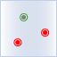   |点A与点B不重合。   
分离_点线| 点查线| 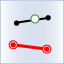  |点A与线B无任何交集。  
分离_点面| 点查面| 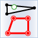  |点A与面B无任何交集。 
分离_线点| 线查点| 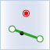  |线A与点B无任何交集。 
分离_线线| 线查线|   |线A与线B无任何交集。 
分离_线面| 线查面| 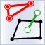  |线A与面B无任何交集。 
分离_面点| 面查点| 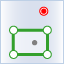  |面A与点B无任何交集。 
分离_面线| 面查线|   |面A与线B无任何交集。 
分离_面面| 面查面| 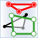  |面A与面B无任何交集。 

### 邻接
  
返回被搜索图层（点、线、面、CAD）中其边界与搜索对象（点、线、面）边界相触的对象。

- 基本关系：搜索对象（A）内部和被搜索对象（B）内部交集为空且（A内部和B边界交集不空 或 A边界B内部交集不空 或 A边界和B边界交集不空）。 
  
**邻接算子详细说明:**  

空间查询条件 | 查询关系 |图示| 说明     
 :----- | :---: | :----: | :----:     
邻接_点线| 点查线|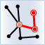   |点A在线B的端点上。 
邻接_点面| 点查面|   |点A在面B的边界上。 
邻接_线点| 线查点|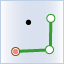  |点B在线A的端点上。 
邻接_线线| 线查线|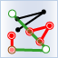   |**线A邻接线B**有三种情况： 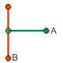   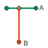 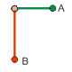  
邻接_线面| 线查面|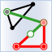   |线A的一个端点在面B的边界上，其余在面B的外部；或者线A的一部分在面B的边界上，其余在面B的外部；或者线A全部在面B的边界上。 
邻接_面点| 面查点|   |点B在面A的边界上。 
邻接_面线| 面查线|  |线B的一个端点在面A的边界上，其余在面A的外部；或者线B的一部分在面A的边界上，其余在面A的外部；或者线B全部在面A的边界上。 
邻接_面面| 面查面|   |面A与面B只有边界有交集。 
  
### 重合
  
返回被搜索图层（点、线、面、CAD）中与搜索对象（点、线、面）完全重合的对象，但对象上的控制点可以不完全相同。 

- 基本关系：搜索对象（A）内部和被搜索对象（B）内部交集为空且（A内部和B边界交集不空 或 A边界B内部交集不空 或 A边界和B边界交集不空）。 
  
**重合算子详细说明:**  

空间查询条件 | 查询关系 |图示| 说明     
 :----- | :---: | :----: | :----:     
重合_点点| 点查点 |  |点重合。 
重合_线线| 线查线 |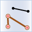 |线重合，控制点可以不同。 
重合_面面| 面查面 |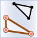  |面重合，控制点可以不同。 
  
### 相交
  
返回与搜索对象（点、线、面、文本、CAD）交叉的所有被搜索对象（点、线、面）。

- 基本关系：搜索对象（A）和被搜索对象（B）有交集。
  
**相交算子详细说明:**  

空间查询条件 | 查询关系 |图示| 说明     
 :----- | :---: | :----: | :----:     
相交_点点| 点查点|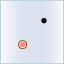  |点A与点B重合。   
相交_点线| 点查线|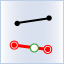  |点A与线B有交集。 
相交_点面| 点查面|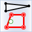 |点A与面B有交集。 
相交_点文本| 点查文本|  |点A与文本B重合。 
相交_线点| 线查点|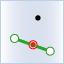  |线A与点B有交集。 
相交_线线| 线查线|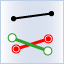  |线A与线B有交集。 
相交_线面| 线查面|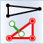  |线A与面B有交集。 
相交_线文本| 线查文本|  |线A与文本B有交集。 
相交_面点| 面查点|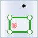  |面A与点B有交集。 
相交_面线| 面查线| 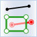 |面A与线B有交集。 
相交_面面| 面查面|  |面A与面B有交集。 
相交_面文本| 面查文本|  |面A与文本B有交集。 

