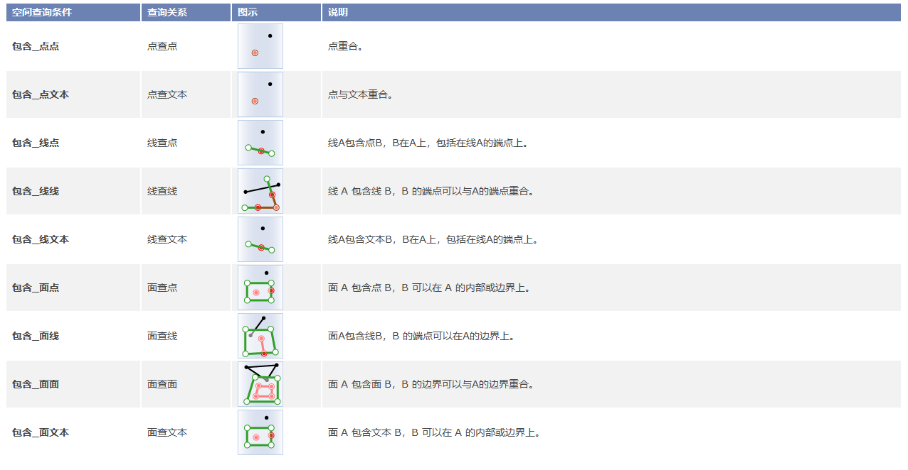
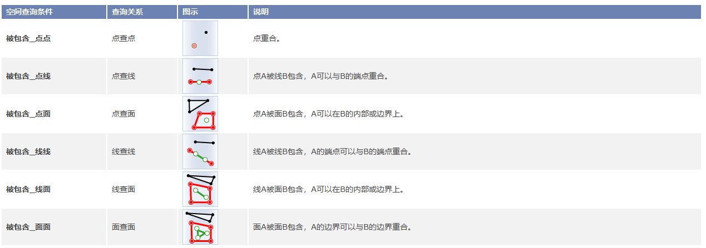
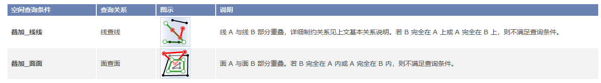
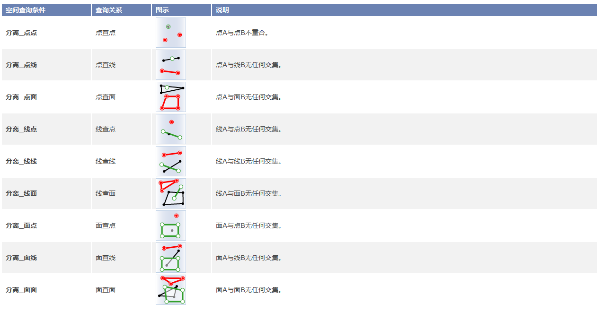
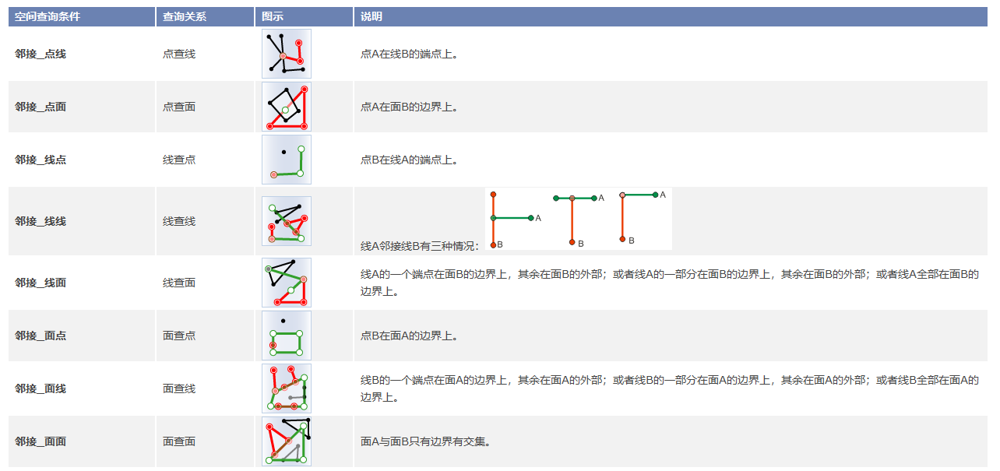
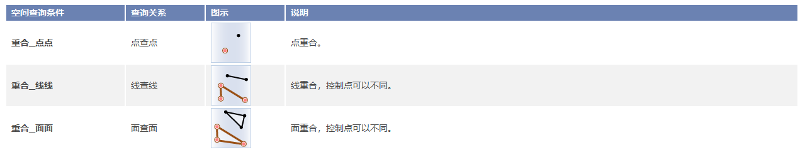
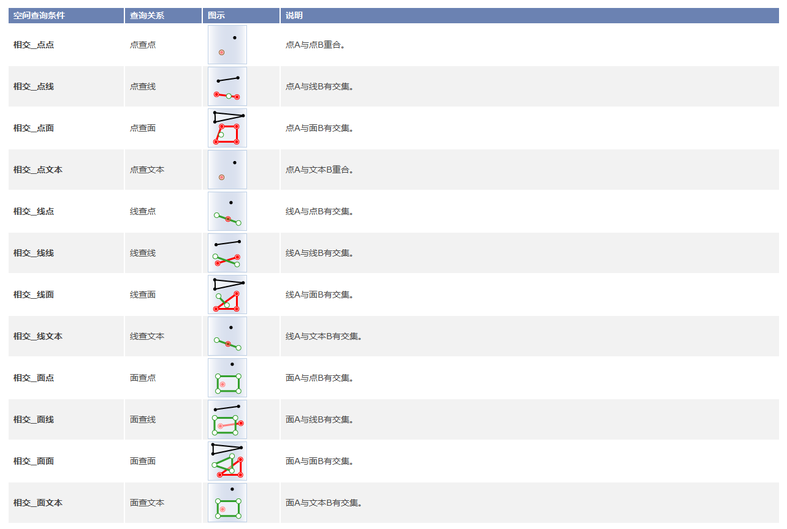

空间查询是通过几何对象之间的空间位置关系来构建过滤条件的一种查询方式。应用程序目前支持 8
种空间查询的基本算子，包括：交叉、包含、被包含、重叠、分离、邻接、重合、相交。

空间查询涉及三个要素，分别为：搜索对象、被搜索图层及结果记录集。对各算子的图示中表达了所有空间查询的搜索对象和结果记录集，其中搜索对象用绿色表示，被搜索图层中的对象用黑色表示，结果记录集中的几何对象用红色表示。

### 交叉

返回被搜索图层（线、面、CAD）中与搜索对象（线）交叉的所有对象。

  * 基本关系：搜索对象（A）穿越被搜索对象（B）。
  * 线查线：A 从 B 内部的一侧进入并在 B 内部的某处另一侧穿出。A 的内部与 B 的内部交集不为空，且拓扑维数为0维。
  * 线查面：A 的内部与B的内部的交集不为空；A 的内部与B的外部的交集不为空。

交叉算子详细说明：  

 ### 包含

 返回被搜索图层（点、线、面、文本、CAD）中搜索对象（点、线、面）所包含的对象。（不一定要完全包含，边界有交集也可以。）

   * 基本关系：搜索对象（A）包含被搜索对象（B）（A、B边界交集可以不为空）。
   * A 的外部与 B 的内部的交集为空，且内部交集不为空或 A 的边界与 B 内部无交集。 
   * A的维数 >= B 的维数。

 包含算子详细说明：

  
 ### 被包含

返回被搜索图层（点、线、面、CAD）中包含搜索对象（点、线、面）的对象。如果返回的对象是面，其必须包含（包括在边界上）搜索对象；如果返回的对象是线，其必须完全包含搜索对象；如果返回的对象是点，其必须在搜索对象上。

   * 基本关系：被搜索图层（B）中包含搜索对象（A）。被包含是包含的逆算子。

 被包含算子详细说明

  
 ### 叠加

 返回被搜索图层（线、面、CAD）中与搜索对象（线、面）部分重叠的对象。

   * 基本关系：搜索对象（A）与被搜索对象（B）交叠。
   * A 与 B 的维数相同。
   * A 的内部与 B 的内部交集（C）不为空，A 的外部与 B 的内部交叉，B 的外部与 A 的内部交叉。
   * C 的类型仍与 A 的类型相同。

 叠加算子详细说明：

  
 ### 分离

 返回被搜索图层（点、线、面、CAD）中与搜索对象（点、线、面）相离的对象。

   * 基本关系：搜索对象（A）和被搜索对象（B）相离，即无任何交集。

 分离算子详细说明：

  
 ### 邻接

 返回被搜索图层（点、线、面、CAD）中其边界与搜索对象（点、线、面）边界相触的对象。

   * 基本关系：搜索对象（A）内部和被搜索对象（B）内部交集为空且（A内部和B边界交集不空 或 A边界B内部交集不空 或 A边界和B边界交集不空）。

 邻接算子详细说明：

  
 ### 重合

 返回被搜索图层（点、线、面、CAD）中与搜索对象（点、线、面）完全重合的对象，但对象上的控制点可以不完全相同。

   * 基本关系：搜索对象（A）与被搜索对象（B）的类型必须相同，且A内部与B内部交集不为空，A边界和B外部交集空，A内部和B外部交集空，节点可以不同。 

 重合算子详细说明：

  
 ### 相交

 返回与搜索对象（点、线、面、文本、CAD）交叉的所有被搜索对象（点、线、面）。

   * 基本关系：搜索对象（A）和被搜索对象（B）有交集。

 相交算子详细说明：

  

