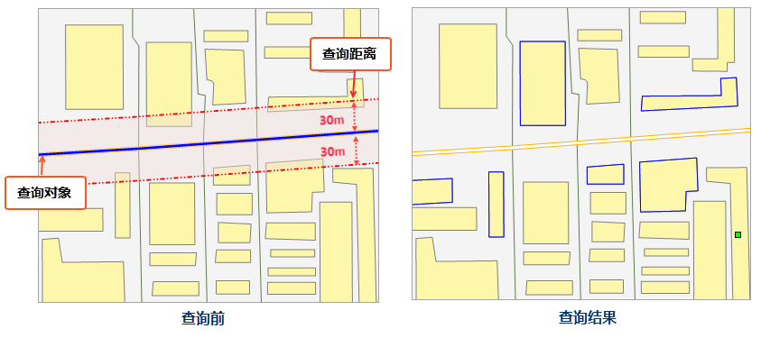

### 使用说明

空间查询是指通过几何对象之间的空间位置关系构建过滤条件，从已有的数据中查询出满足过滤条件的对象，同时支持对查询对象设置查询距离。目前支持点、线、面几何对象的空间查询功能。

### 操作步骤

1. 在地图窗口中选择用于进行空间查询的搜索对象。例如：若对某扩建的道路，该道路即为搜索对象。
2. 单击功能区 > **空间分析** 选项卡 > **查询** 组中的 **空间查询** 按钮，弹出 **空间查询** 对话框。

只要当前地图窗口中存在非空的点、线、面、文本、CAD 数据集，“空间查询”按钮即为可用状态。当“空间查询”对话框打开后，也可在地图窗口中选择搜索对象。

当地图窗口中已经选择了搜索对象后，“空间查询”对话框上方的“搜索图层”下拉列表中，显示出了所有选中的搜索对象所在图层。用户可单击“搜索图层”下拉箭头，在下拉列表中指定搜索对象所在的一个搜索图层。

3. 指定被搜索图层，即选择被查询的对象是在哪个图层上。例如要查询一条道路周边的居民区，则居民区图层就是被搜索图层。 

在被搜索图层列表中显示了当前地图窗口中，能够进行空间查询的所有图层（包括所有非空的点、线、面、文本、CAD）。通过勾选各图层列表中复选框，可确定是否对该图层执行空间查询操作。

4. 设置被搜索图层的空间查询条件和属性查询条件。

**设置空间查询条件：**
在被搜索图层列表中，单击“空间查询条件”下拉按钮，在下拉列表中选择一个系统支持的空间查询算子。选择了一个空间查询算子后，“算子描述”区域会对选中的算子予以图示和解释说明。目前，应用程序支持的空间查询算子共有8种，具体内容请参阅
[空间查询基本算子](SQ_BasicOperators)。

**设置属性查询条件：** 在被搜索图层列表中，单击“属性查询条件”下拉按钮，在下拉列表中单击“表达式...”命令，弹出“[SQL
表达式](SQLDia)”对话框，构建被搜索图层的属性字段查询条件。例如要查询一条河流经过的，并且人口数量大于100万的城市，则SQL
表达式中可以设置该城市的人口字段>1000000。 如果不需要属性控制条件，则此项可以保持为空，则相应图层的查询结果为所有符合空间查询条件的对象。

5. **设置查询距离** ：勾选“设置查询距离”复选框，可设置查询距离及单位。查询对象将按照指定半径做缓冲区分析，再对包含缓冲区范围的区域进行查询。例如，要查询某道路30m 范围内存在的居民区，则设置查询距离为30m，简化了用户常规先分析再查询的操作。

**注意** ：部分空间查询条件对设置查询距离不生效。下表为每种查询条件是否支持设置查询距离详细描述： **√** 表示支持设置查询距离； **×**
表示设置查询距离不生效； **\--** 表示不支持的查询算子。

查询对象 | 被查询对象 | 交叉 | 包含 | 被包含 | 重叠 | 分离 | 邻接 | 重合 | 相交  
---|---|---|---|---|---|---|---|---|---  
**点** | 点 | \-- | √ | × | \-- | √ | \-- | × | √  
线 | \-- | \-- | × | \-- | √ | × | \-- | √  
面 | \-- | \-- | √ | \-- | √ | × | √ | √  
**线** | 点 | \-- | √ | \-- | \-- | √ | × | \-- | √  
线 | × | √ | × | × | √ | × | × | √  
面 | × | \-- | √ | \-- | √ | × | \-- | √  
**面** | 点 | \-- | √ | \-- | \-- | √ | × | \-- | √  
线 | \-- | √ | \-- | \-- | √ | × | \-- | √  
面 | \-- | √ | √ | √ | √ | × | × | √  
6. 设置查询结果保存方式。选中被搜索图层，可对该图层的查询结果进行设置。 

**保存查询结果：** 勾选“保存查询结果”复选框，可将查询结果保存为新的数据集。

* 数据源：用于设置和显示查询结果所要保存的目标数据源。下拉列表中列出了当前工作空间中所有非只读数据源，用户可指定一个保存结果数据集的目标数据源。
* 数据集：用于设置和显示新数据集的名称，默认名称为：SpatialQuery_1。

**只保存空间信息：** 勾选“只保存空间信息”复选框，设置只保存查询结果的空间信息，不保存其属性信息。

此外，使用工具条中的全选、反选、重置按钮可对被搜索图层进行全选、反选或重新设置查询信息操作。

7. 设置查询结果显示方式。选中被搜索图层，在“结果显示”区域设置该图层的查询结果显示方式。同时勾选多个复选框，可实现二三维联动浏览查询结果。 

**结果显示：** 用于设置查询结果的显示情况。

* 在属性表中浏览查询结果：选中该复选框，则查询结果以属性表形式打开。
* 在地图窗口中高亮显示查询结果：选中该复选框，则可在地图窗口中高亮显示查询结果。
* 在场景窗口中高亮显示查询结果：选中该复选框，则可在场景窗口中高亮显示查询结果。
8. 完成各项设置后，单击“查询”按钮，执行空间查询操作。

**应用场景：** 对某道路进行扩建，需要查询出该道路两侧30m
范围内需要拆迁的居民区。选择待扩建道路为查询对象，居民区面数据集设置为被查询对象，空间查询条件设置为 **相交_线面**
，设置查询距离为30m，查询结果则为查询范围内相交的面对象（蓝色框），查询结果如下图所示。

  

### 备注

1. 支持对开启动态投影的地图进行空间查询，可将查询对象投影到被查询图层上进行查询，结果数据集的坐标系与被查询图层一致。
2. 只有当选择了搜索对象后，才能对被搜索图层设置空间查询条件，否则在输出窗口中会出现提示信息“请指定搜索对象”。
3. 当被搜索图层为CAD数据集（CAD数据集是一种复合数据集，可能同时包含点，线，面等几何对象）进行空间查询时，空间查询条件中的可选算子包含了搜索对象与点，线，面数据集进行空间查询时的所支持的全部算子。

###  相关主题

 [空间查询基本算子](SQ_BasicOperators)

 [空间查询示例](SpatialQuery_Example)

