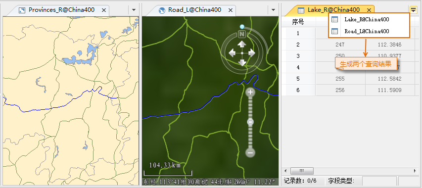

本文以示范数据 China.udb 数据源中的道路、湖泊、行政区划图层为例，查询：

  * 湖南省包含哪些湖泊；
  * 经过湖南省境内、且公路代码为 G320 的公路有哪几条。

具体操作步骤为：

  1. 在当前工作空间中，打开示范数据 China400.udb 数据源。
  2. 新建一个地图窗口，将 Provinces_R、Lake_R 和 Road_L 三个数据集添加到新建的地图窗口中。
  3. 在地图窗口中，选中 Provinces_R 图层中的湖南省行政区划面，该面即为空间查询的搜索对象。
  4. 单击 **空间分析** 选项卡 > **查询** 组中的 **空间查询** 按钮，弹出“空间查询”对话框。
  5. 在被搜索图层列表中，设置需要进行搜索的空间查询条件和属性查询条件。 
    * 在 Road_L 图层列表中，单击“空间查询条件”下拉按钮，设置空间查询算子为“相交_面线”，即查询哪些公路穿过湖南省境内；
    * 在 Road_L 图层列表中，单击“属性查询条件”下拉按钮，在下拉列表中单击“表达式...”按钮，弹出 SQL 表达式对话框，在对话框中设置被搜索的公路需要满足属性条件：Road_L.CODE = "G320"。
    * 在 Lake_R 图层列表中，单击“空间查询条件”下拉按钮，设置空间查询算子为“包含_面面”，即查询湖南省区划范围内包含哪些湖泊。
  6. 选中 Road_L 和 Lake_R 图层，在“结果显示”区域中勾选“在属性表中浏览查询结果”、“在地图窗口中高亮显示查询结果”、“在场景窗口中高亮显示查询结果”三个复选框。
  7. 选中 Road_L 图层，勾选“保存查询结果”复选框，设置将对 Road_L 图层的查询结果保存到 China.udb 数据源，并重命名结果数据集名称为：湖南省公路_G320。 

同样方式，将 Lake_R 图层的查询结果数据集命名为：湖南省湖泊。

  8. 单击“ **查询** ”按钮，执行空间查询操作。
  9. 在属性表、地图、场景窗口中，同时浏览查询结果。在查询结果属性表中任意选中一条记录，在地图窗口和场景窗口中会自动定位到相应对象，实现二三维关联浏览。    
