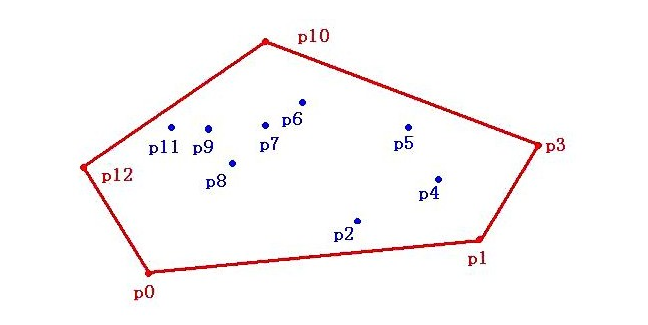
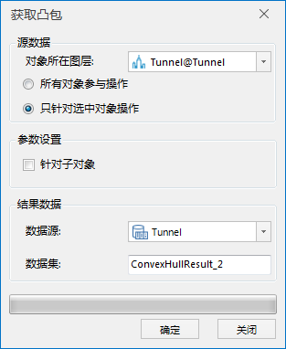
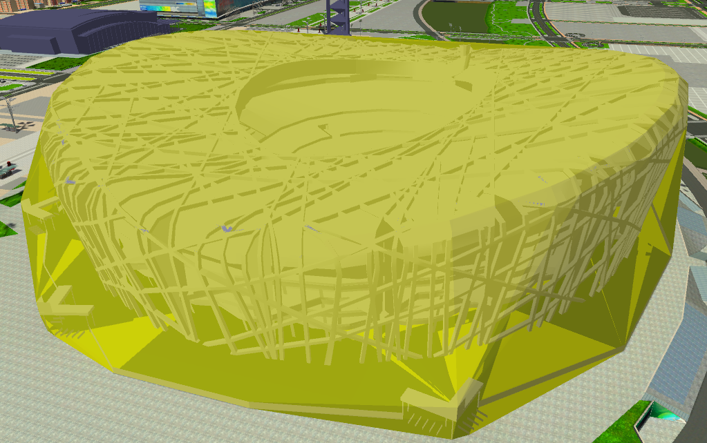

**使用说明**

凸包（Convex Hull）是计算机图形学中的概念，在二维平面中，凸包是一个最小凸多边形，它能满足点集中的任何点或在多边形边上，或在多边形内，如下图所示，红色线所表示的多边形为一个平面凸包，它能够包含点集P。

  
 
  
同样，三维模型对象可以看作三维空间中由无数个三维点构成的点集，该模型对象的凸包即是一个能够包含选中模型的所有三维点的 **最小闭合几何体** 。
由于凸包是一个与原模型对象相似且结构简单的几何体，并且由于它是闭合的，可用于模型对象的[布尔运算](ModelBooleanOperation)

**操作步骤**

  1. 打开包含模型数据集的数据源，将模型数据集添加到球面场景中。
  2. 在" **三维地理设计** "选项卡上“ **三维体分析** ”组内，单击“ **凸包** ”按钮，弹出“获取凸包”对话框，如下图所示：  
  
  
  
  3. 源数据：设置用于生成凸包的模型对象。 
       * 对象所在图层：下拉选择一个模型数据集图层；
       * 可选择图层的所有模型对象或图层中被选中的模型进行操作。 
         * 所有对象参与操作：即图层的所有模型对象都将生成凸包；
         * 只针对选中对象操作：即图层中仅被选中的模型将生成凸包，勾选此项需确保场景中已有模型对象被选中，通过鼠标左键选中单个模型或按住键盘的“Shift”键，配合鼠标左键可选择多个对象。
  4. 参数设置：设置是否针对子对象进行凸包构建。 
  5. 结果数据：设置结果数据的存放信息。 
       * 数据源：设置结果数据集存放数据源。
       * 数据集名称：可自行定义，输入字符串作为结果数据集的名称。
  6. 设置完以上参数，点击“确定”按钮，即可执行构建凸包操作。

获取凸包成功后，将在指定的结果数据源下生成一个模型数据集，将该模型数据集添加到球面场景中浏览，如下图所示为一个模型对象生成凸包的操作结果。

  

**注意事项**

  1. 桌面软件支持对模型或三维点进行凸包计算。

 

