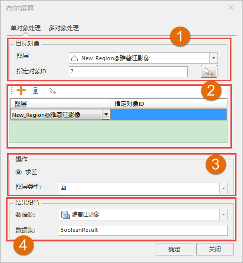
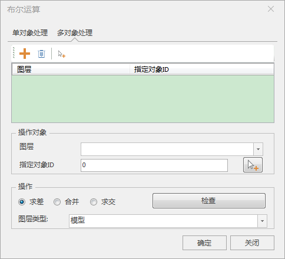
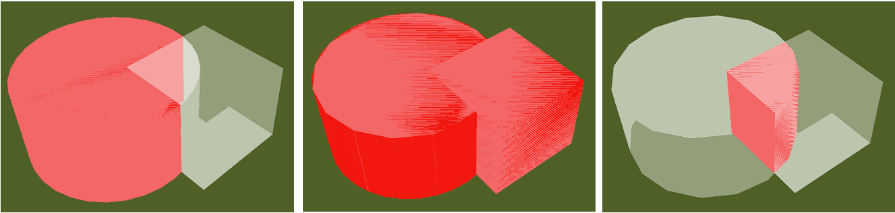
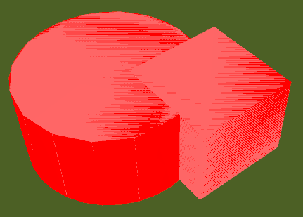
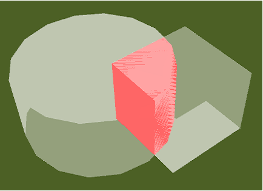

**使用说明**

布尔运算是数字符号化的逻辑推演法，SuperMap引用这种逻辑运算方法对三维模型、二维面、三维面等对象间进行合并、求差、求交运算，输出结果数据。

布尔运算分为单对象处理和多对象处理。二/三维面对象之间只支持求差运算，模型对象间支持求差、合并和求交运算。

  * 单对象处理是单个A对象与另外多个B对象之间进行布尔运算，此时A对象与B对象可以在同一个图层也可以在不同图层，且不同的B对象也可以在不同图层，最后输出结果为单个对象。
  * 多对象处理是多个A对象与另外单个B对象之间进行布尔运算，A/B图层之间的关系与上述相同，输出结果为多个对象。

**操作步骤**

  1. 打开包含模型数据集或者二/三维面数据的数据源，将需要进行布尔运算的数据集添加到球面场景中。
  2. 在" **三维地理设计** "选项卡上“ **三维体分析** ”组内，单击“ **布尔运算** ”按钮，弹出“布尔运算”对话框。
  3. **单对象处理**  
  

       * 确认操作图层类型，在图3所示的图层类型内选择是模型还是面。
       * 在如图1所示的部分确认目标对象，确认目标对象所在图层然后单击按钮选择对象，单击鼠标右键结束选择。
       * 在如图2所示的部分确认操作对象，按钮添加一行；按钮指定对应图层的操作对象。
       * 若是模型对象可以在图3所示的部分选择求差、合并还是求交操作，并且可以通过“检查”按钮检查操作对象是否符合布尔运算要求。
       * 如图4的部分设置结果数据，设置结果数据的存放信息。
  4. **多对象处理**    
  

       * 首先确认图层类型，通过图层类型下拉菜单选择模型或者面。
       * 确认目标对象，通过按钮添加一行；按钮指定对应图层的目标对象。
       * 确认操作对象，通过指定图层和按钮指定操作对象。
       * 选择操作类型，模型支持求差、合并和求交，并且支持检查对象是否满足布尔运算的操作要求；面仅支持求差操作。
  5. 设置完以上参数，点击“确定”按钮，即可执行对象的布尔运算操作，在指定的结果数据源下生成一个数据集名称命名的模型数据集。

如下所示为模型对象的布尔运算结果。

     

**注意事项**

  1. 选择进行布尔运算的模型对象必须是闭合的。
  2. Shift+鼠标左键实现对图层中的对象多选操作。

 

