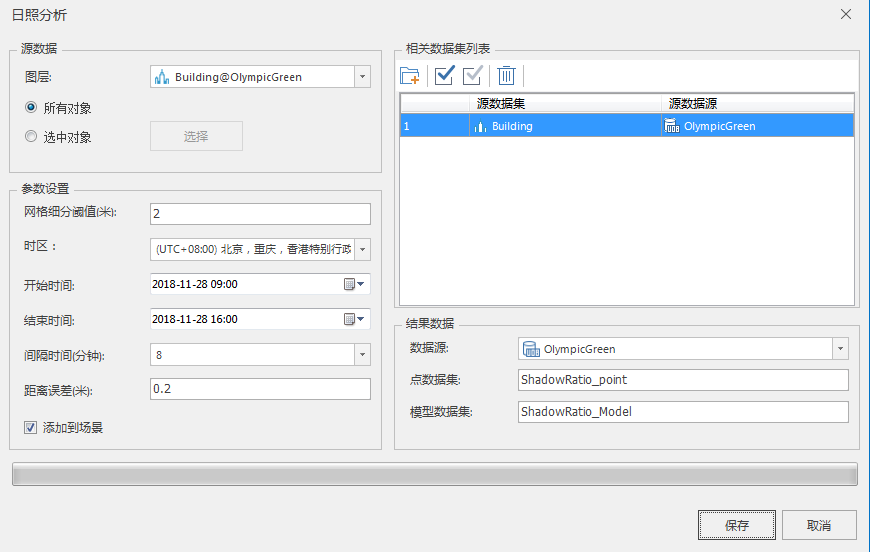
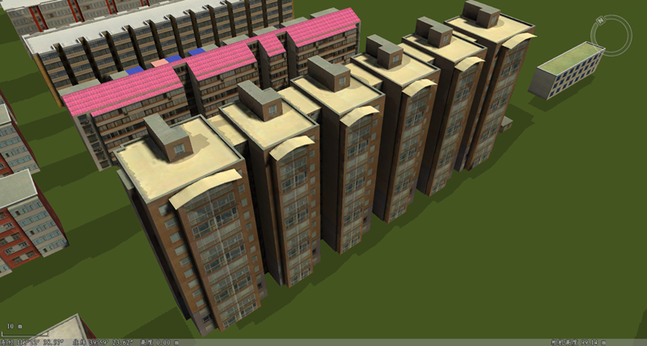
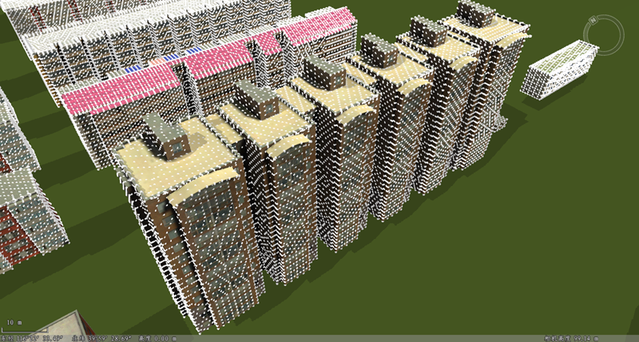
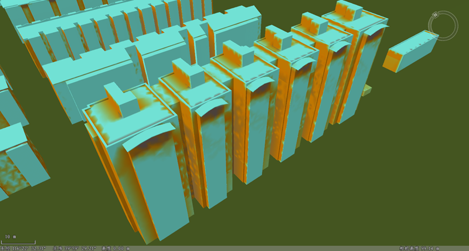

**使用说明**

在三维场景下，“日照分析”功能用来计算选择对象或图层在特定时段的采光率，同时同步导出带日照率的点数据集和模型数据集。

该日照分析是基于模型数据进行日照分析，相较于基于GPU的“[日照分析](../../RealspaceSpatialAnalyst/SunshineAnalyst  )”，精度较高，但分析时间较长。

**操作步骤**

  1. 打开包含模型数据集的数据源，将需要进行日照分析的模型数据集添加到球面场景中。
  2. 在" **三维地理设计** "选项卡上“ **三维体分析** ”组内，单击“ **日照分析** ”按钮，弹出“日照分析”对话框，如下图所示：
  

  3. 源数据选择：选择进行日照分析的模型对象。
       * 确定模型对象所在图层：单击图层右侧的下拉箭头，在弹出的下拉菜单中选择模型对象所在的图层，默认加载显示当前图层。
       * 确定模型对象：单选“所有对象”或“选中对象”。当选择“选中对象”时，单击“选择”按钮，在场景中框选模型对象（右键结束操作），在弹出的“选择对象”对话框中进行相关参数设置，单击“确定”按钮执行对象选择操作，返回“日照分析”对话框。此时，输出窗口显示被选中对象数目。
  4. 参数设置：设置日照分析的相关参数，包括栅格细分阈值、日照时间段、间隔时间、距离误差、颜色设置、相关数据集。
       * 网格细分阈值：单位为米，默认为2，表示当相邻两点之间的距离大于2米时，需要进行点插值。可以根据需要设置具体的阈值。
       * 时区：单击时区右侧的下拉箭头，选择时区。默认值为(UTC+8:00)北京，重庆，香港特别行政区，乌鲁木齐。
       * 开始时间：单击开始时间右侧图标，选择开始时间。
       * 结束时间：单击结束时间右侧图标，选择结束时间。
       * 间隔时间：设置日照率收集的间隔时间，单位为分钟，默认为8。
       * 距离误差: 设置点之间距离误差值，单位为米，默认为0.2。
       * 相关数据集列表：选择涉及的数据集，可以添加、删除数据集。
  5. 结果数据设置：包括选择结果数据存储的数据源、设置点数据集名和模型数据集名、自定义是否将点数据集和模型数据集添加到场景。
       * 数据源：单击“数据源”右侧的下拉箭头，在弹出的下拉列表中选择数据源。
       * 点数据集：输入字符串作为点数据集的名称，默认为ShadowRatio_point_1。
       * 模型数据集：输入字符串作为模型数据集的名称，默认为ShadowRatio_Model_1。
       * “添加到场景”选项：默认勾选“添加到场景”，生成的点数据集和模型数据集同步添加进场景。
  6. 设置完以上参数，单击“保存”按钮，执行模型对象的日照分析，在指定的结果数据源下生成点数据集和模型数据集。  

  

 
 
  

  
 

