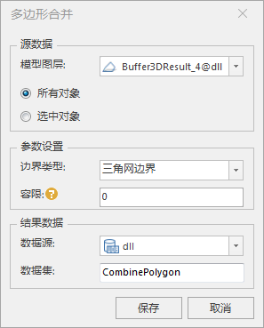

### 使用说明

多边形合并是指多个多边形合并。

### 操作步骤

  1. 打开包含面数据集的数据源，选择模面数据集，右键单击“添加到新球面场景”，在图层管理器中选中模型数据集图层，右键单击“快速定位到本图层”。
  2. 在" **三维地理设计** "选项卡上“ **运算分析** ”组内，单击“ **多边形合并** ”按钮，弹出“多边形合并”对话框，如下图所示：       
  

  3. 源数据选择：选择进行多边形合并的面对象。
      *  确定面对象所在图层：单击图层右侧的下拉箭头，在弹出的下拉菜单中选择面对象所在的图层，默认加载显示当前图层。
      *  确定面对象：单选“所有对象”或“选中对象”。  
  4. 参数设置：设置多边形合并的相关参数，包括边界类型和容限。
      *  边界类型：提供三角网边界和投影轮廓边界两种边界类型。 
      *  容限：两点距离插值小于设置的容限值视为相同点。
  5. 结果数据设置：包括选择结果数据存储的数据源、数据集名称。
      *  数据源：单击“数据源”右侧的下拉箭头，在弹出的下拉列表中选择数据源。
      *  数据集：输入字符串作为数据集的名称。
  6. 设置完以上参数，单击“保存”按钮，执行多边形合并，在指定的结果数据源下生成面数据集。

