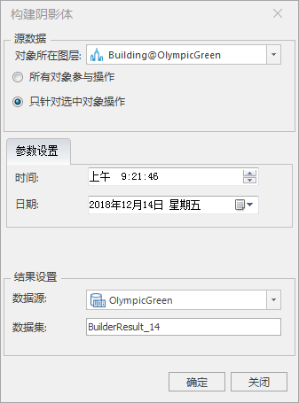
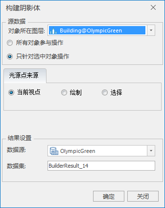
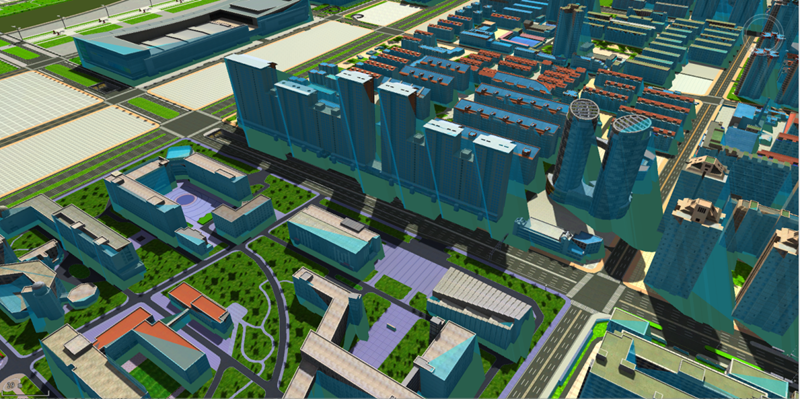
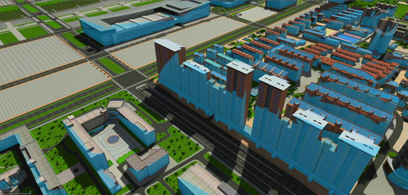

**使用说明**

利用太阳光源或点光源对指定模型对象构建阴影体。构建阴影体支持模型数据集，构建的阴影体是闭合的，则可以参与模型的布尔运算。当设置阴影体的高度模式为贴对象，能直观的看到模型在光源下的阴影区域。

**操作步骤**

  1. 打开包含模型数据集的数据源，将需要构建阴影体的模型数据集添加到球面场景中。
  2. 在" **三维地理设计** "选项卡上“ **三维体分析** ”组内，单击“ **阴影体** ”下拉按钮，在弹出的下拉菜单中选择“太阳光源”或“点光源”，分别弹出如下对话框：  
    

  3. 选择构建阴影体的源模型所在图层。 操作对象单选”所有对象“还是”只针对选中对象“。 
       * 所有对象参与操作：该图层中所有的模型对象构建阴影体。
       * 只针对选中对象操作：该图层中选中的模型对象构建阴影体。
  4. 参数设置 
       * 构建太阳光源下模型对象的阴影体可以自行设置日期与时间，默认读取时区与本地一致的当前时间。
       * 构建点光源下模型对象的阴影体是以当前视点为点光源或者自行绘制点光源或者在场景中拾取点对象，作为光源来源。
  5. 结果数据：设置结果数据的存放信息。 
       * 目标数据源：设置结果数据集存放的数据源。
       * 目标数据集：数据集名称默认为BuilderResult。可自行定义，输入字符串作为结果数据集的名称。
  6. 设置完以上参数，单击“确定”按钮，即可构建指定模型对象的阴影体，在指定的结果数据源下生成一个数据集名称命名的模型数据集。下图蓝色半透模型是模型的阴影体：
     
  
  
设置阴影体所在图层的填充风格，前景色为浅蓝，透明度为60，高度模式为贴对象，如下图所示：  
  

**注意事项**

  1. 拾取点作为光源时，需要先拾取到点后再点开构建阴影体功能。
  2. 通过Shift+鼠标左键，实现对图层中的模型对象的多选。

 

