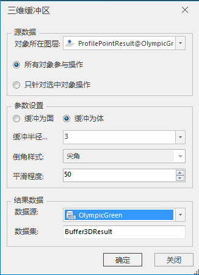

### 使用说明

"三维缓冲体"功能可以将三维点、线、面、模型构建缓冲为三维面或三维体。

### 操作步骤

  1. 打开包含三维点/线/面/模型数据集的数据源，将需要进行三维缓冲区操作的数据集添加到球面场景中。
  2. 在" **三维地理设计** "选项卡上“ **运算分析** ”组内，单击“ **三维缓冲体** ”按钮，弹出“三维缓冲区”对话框，如下图所示：     
  

  3. 源数据选择：选择进行三维缓冲区的对象。
      * 确定对象所在图层：单击对象所在图层右侧的下拉箭头，在弹出的下拉菜单中选择对象所在的图层，支持三维点图层、三维线图层、三维面图层和模型图层。
      * 确定对象：单选“所有对象参与操作”或“只针对选中对象操作”。当选择“只针对选中对象操作”时，需要事先在图层上选择对象。
  4. 参数设置：设置三维缓冲区操作的相关参数，包括缓冲类型、扩展半径、倒角样式、平滑程度。
      * 缓冲类型选择：单选“缓冲为面”或“缓冲为体”，对于三维面对象，只能选择“缓冲为面”，对于模型对象，只能选择“缓冲为体”。
      * 缓冲半径：直接输入扩展半径值，默认值为3，单位为米。
      * 倒角样式：对于三维线缓冲为体时，提供圆弧和椭圆弧选项。对于三维面缓冲为面，提供尖角和圆角选项。其余情况该参数不可用。
      * 平滑程度：当缓冲类型选择为缓冲为体时，直接输入数值，或者通过右侧的上下箭头调整。其余情况该参数不可用。
  5. 结果数据设置：包括选择结果数据存储的数据源、设置结果数据集名。
      * 数据源：单击“数据源”右侧的下拉箭头，在弹出的下拉列表中选择数据源。
      * 数据集：输入字符串作为数据集的名称，默认为Buffer3DResult。
  6. 设置完以上参数，点击“确定”按钮，即执行三维缓冲区操作，在指定的结果数据源下生成一个数据集名称命名的模型数据集。

### 注意事项

  1. 三维面对象只支持缓冲为面。
  2. 平滑程度值设置只在三维点、线执行缓冲为体操作情况下可用。

