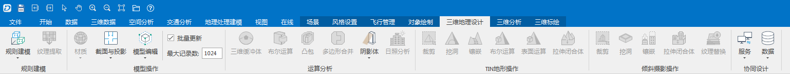

三维地理设计中，集成了一些常用的建模、三角网以及针对模型、TIN地形、倾斜摄影数据的工具，例如模型拆分、地质钻孔、TIN镶嵌、倾斜摄影模型剔除悬浮物等。

  
---  
三维地理设计选项卡示意  
  
###  对象场景操作

[顶点捕捉](SupportSnap)

对倾斜摄影模型和BIM模型支持顶点捕捉，便于在数据上进行操作。

### 三维地理设计相关功能

#### [规则建模](Modeling/Modeling)

包含对二三维点线面对象拉伸、快速建模以及提取倾斜摄影模型纹理的相关操作，包括 **线性拉伸** 、 **旋转拉伸** 、 **拉伸闭合体** 、
**矢量拉伸** 、 **放样** 、 **构建坡屋顶** 、 **构建房屋** 以及 **纹理提取** 等功能。

#### [模型操作](ModelOperation/ModelOperation)

“ **三维地理设计** ”下的“ **模型操作** ”组中的模块主要包括： **材质** 、 **截面与投影** 、 **模型编辑** 以及
**模型切分** 等。

#### [运算分析](3DAnalysis/3DAnalysis)

“ **三维地理设计** ”选项卡中“ **运算分析** ”模块主要包括了“ **三维缓冲体** ”、“ **布尔运算** ”、“ **凸包** ”、“
**多边形合并** ”、“ **阴影体** ”以及“ **日照分析** ”等功能。

#### [TIN地形操作](TINTerrainOperation)

“ **三维地理设计** ”选项卡中“ **TIN地形操作** ”模块包括 **裁剪** 、 **挖洞** 、 **镶嵌** 、 **布尔运算** 、
**表面运算** 以及 **拉伸闭合体** 等功能。

#### [倾斜摄影操作](../OSGB/OSGBObjOperation/OSGBObjOperation)

“ **三维地理设计** ”选项卡中“ **倾斜摄影操作** ”模块主要包括 **裁剪** 、 **挖洞** 、 **镶嵌** 、 **拉伸闭合体** 和
**纹理替换** 等功能。

#### [协同设计](CollaborativeDesign/CollaborativeDesignDia)

“ **三维地理设计** 选项卡中 **协同设计** ”组下涉及服务连接和协同编辑数据操作，例如 **请求Revit数据** 、 **协同编辑** 、
**清空数据** 等等。

###  相关主题

 [城市小品](../PlantTees/PlantTees)

 [布告板](BulletinBoard)

