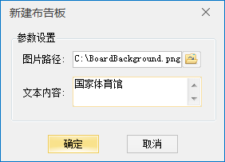
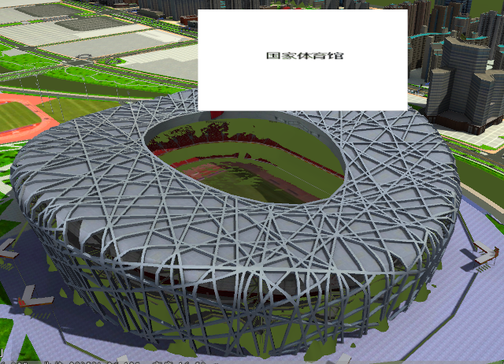

**使用说明**

布告板用来显示和传递信息。“布告板”功能是在KML图层上进行绘制布告板。

布告板绘制涉及图片和文字的设定，其中布告板的锚点在底部中心位置，图片锚点在左上角。

**操作步骤**

  1. 新建一个球面场景,在图层管理中单击“普通图层”右键，选择“添加KML图层…”，加载KML图层。
  2. 点击KML图层前的图标或者单击加载的KML图层右键，选择“可编辑”，将图层设置为可编辑模式。
  3. 在“对象绘制”选项卡上的“布告板”组中，单击“新建”按钮，弹出“新建布告板”对话框，如下图所示：    
     
 
     * 图片路径：点击右侧文件夹图标，选择布告板背景图片的路径。
     * 文本内容：添加布告板上需要显示的文本内容。
  4. 点击“确定“，鼠标点击获得布告板放置的位置，进行布告板新建。示范布告板新建结果如下：    
     
 

**注意事项**

  1. 布告板新建只针对KML图层。KML图层必须设置为可编辑模式才能激活布告板新建功能。

 

