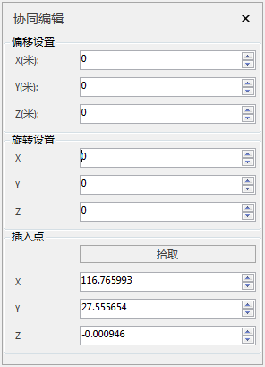

**使用说明**
“协同编辑”功能实现在三维场景中编辑Revit数据，可偏移模型、旋转模型和修改模型插入点。

**操作步骤**

1. 在“ **三维地理设计** ”选项卡上“ **协同设计** ”组内的“ **数据** ”下拉按钮中，在弹出的下拉菜单中单击“ **编辑** ”按钮，弹出"协同编辑"悬浮框：  
  

2. 偏移设置：直接输入x、y、z方向的偏移值，或者通过上下箭头改变数值。
3. 旋转设置：直接输入x、y、z方向的旋转角度，或者通过上下箭头改变数值。
4. 插入点设置：单击“拾取”按钮，在场景中单击鼠标左键确认插入点，实时改变模型位置和获取经度值、纬度值、高程值，获取的经度值、纬度值、高程值显示在“协同编辑”对话框内的相应位置。

 

