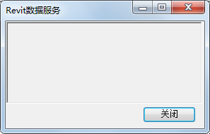
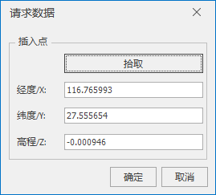
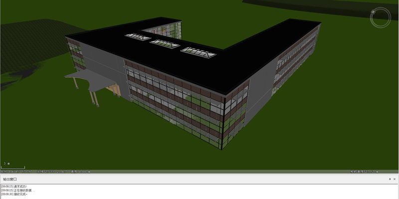

**使用说明**

“ **请求Revit数据** ”功能实现将Autodesk Revit软件上打开的数据加载到三维场景。

Autodesk Revit平台需要以管理员身份运行，事先需要添加服务启动模块：SuperMap Collaborative for Revit模块。

**操作步骤**

1. 新建球面场景。在工作空间管理器中右键单击“场景”，选择 “新建球面场景”。 
2. 启动Revit数据服务。首先以管理员身份运行Autodesk Revit软件，然后打开需要进行协同操作的文件，最后在“附加模块”内单击“StartServer”按钮启动Revit数据服务，弹出“Revit数据服务”对话框。  
    
 
3. 在" **三维地理设计** "选项卡上“ **协同设计** ”组内，单击“ **服务** ”按钮，弹出"请求数据"对话框：  
  
 
4. 插入点设置：单击“拾取”按钮，在场景中单击鼠标左键确认插入点，实时获取经纬度值和高程值，并显示在“请求数据”对话框中的对应位置。
5. 点击“确定”按钮，进行接收Revit数据，完全接收后，输出窗口中显示“接收成功”，场景中显示Revit数据，运行效果如下图所示。  
  

**注意事项**

1. Autodesk Revit平台必须以管理员身份运行。
2. 对于Windows 8/8.1/10操作系统，需要开启用户账户控制：双击安装目录下Tools/EnableUA/EnableUA.reg的EnableUA.reg。

 

