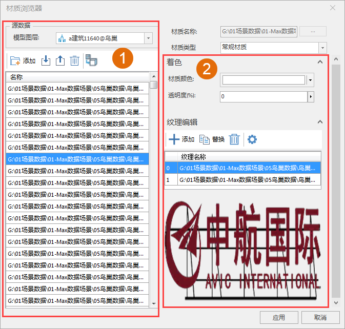
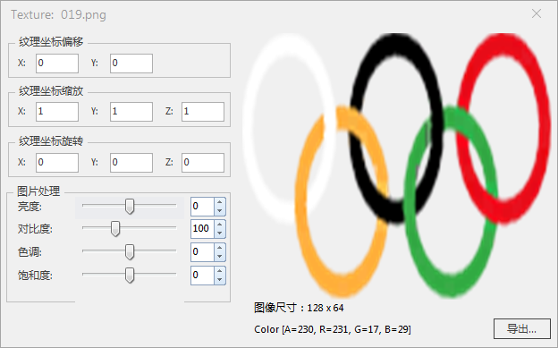
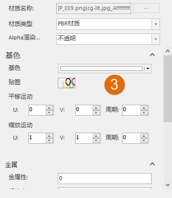

### 使用说明

材质功能提供模型数据的材质浏览器，不仅可以浏览模型数据的材质，也可以修改模型对象的材质。

### 操作步骤

  1. 在工作空间管理器中右键单击“数据源”，选择“打开文件型数据源”，打开包含模型数据集的数据源。
  2. 选择模型数据集，右键单击“添加到新球面场景”，在图层管理器中选中模型数据集图层，右键单击“快速定位到本图层”。
  3. 单击“ **三维地理设计** ”选项卡中“ **模型操作** ”组中" **材质** "下拉按钮中的“材质”按钮，弹出“材质浏览器”对话框，如下图所示：     
  
  4. 材质列表区域(如数字1所示)： 
      * 模型图层选择：在图层组中，单击“模型图层”右侧的下拉箭头，选择模型对象所在的图层。
      * 新建材质：单击**添加**按钮，在弹出的“新建材质”对话框中创建材质名称。材质类型支持选择常规材质类型和PBR材质类型。
      * 导入材质信息：单击**导入**按钮，支持导入带材质信息的XML文件。
      * 导出材质信息：单击**导出**按钮，导出选中材质的带材质信息的XML文件以及纹理。
      * 删除材质信息：单击**删除**按钮，删除选中材质。
      * 将材质赋给选中对象：单击**将材质赋给选中对象**按钮，可以将选中的材质批量赋予给场景中选中的模型对象。
      * 列表区域显示了当前模型对象的所有材质。
  5. 材质名称：显示选中材质的名称
  6. 材质类型：提供常规材质和PBR材质两种类型。
  7. 常规材质编辑区域（如数字2所示）： 
      * 材质颜色：通过下拉的颜色面板设置材质颜色。
      * 透明度：通过直接输入数值或者单击向右箭头，滑动弹出的滑块来调整透明度。默认透明度的数值为 0，表示图层完全不透明，随着数值的增大图层会变得越来越透明；当透明度的数值设为 100 时，图层完全透明。透明度数值的范围为 0 至 100 。
      * 纹理编辑：提供添加、替换、删除以及设置按钮。
        * 添加：单击**添加** 按钮，在弹出的“打开”对话框选择添加的图片文件。
        * 替换：单击**替换** 按钮，在弹出的“打开”对话框选择图片文件替换选中的纹理。
        * 删除：单击**删除** 按钮，删除选中的纹理。 
        * 设置：单击**删除** 按钮，在弹出的面板中设置贴图的纹理参数。   

    
  

  8. PBR材质编辑区域（如数字3所示）     
    
      * Alpha渲染模式：提供不透明、掩模、混合和未知四种模式。
      * 基色：设置材质的基色。包括基础色、贴图、平移运动和缩放运动。
      * 金属性：金属性代表为模型赋予金属光泽，有金属性、粗糙度以及贴图三种参数。金属性和粗糙度的取值范围为0-1，1代表材质为金属，材质完全粗糙，0代表材质完全平滑。
      * 自发光：支持设置自发光参数，包括颜色、贴图、平移运动和缩放运动。
      * 勾选法线，支持设置法线相关参数：法线系数和贴图。法线系数是用于法线的缩放。
      * 勾选遮挡，支持设置遮挡轻度相关系数：遮挡系数和贴图。遮挡系数用于设置遮挡的强度。
      * Alpha过滤阈值：只有Alpha渲染模式为掩模模式时，该参数可用，低于Alpha过滤阈值的对象不显示。
      * 双面：默认不勾选。若勾选，则说明双面渲染。
9. 设置完成后，单击应用即可将设置的材质参数应用到模型对象。

### 备注

  1. 贴图的纹理参数主要包括纹理坐标偏移、纹理坐标缩放、纹理坐标旋转以及图片的亮度、对比度和饱和度。同样还支持导出纹理
  2. 颜色主要是通过通过相应颜色参数右侧下拉的颜色面板设置。
  3. 平移运动和缩放运动支持设置沿U和V方向平移运动或者缩放变化的速度，范围为纹理坐标单位/秒。还支持设置纹理平移或缩放的周期，单位为秒。

