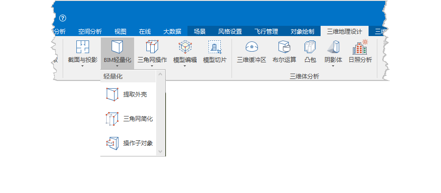

**使用说明**

提取外壳是基于可视域分析功能，实现对BIM模型的可见部分（外壳）与不可见部分（内部模型）的分离。

**操作步骤**

  1. 在工作空间管理器中右键单击“数据源”，选择 “打开文件型数据源”，打开包含BIM模型数据集的数据源。
  2. 选择模型数据集，右键点击“添加到新球面场景”，在图层管理器中选中模型图层，右键单击“快速定位到本图层”，在场景窗口按住鼠标滚轮将相机调整至便于观察模型的视角。
  3. 单击“ **三维地理设计** ”选项卡中“ **模型操作** ”组中“ **BIM轻量化** ”下拉按钮，在弹出的下拉菜单中选择“提取外壳”，显示“提取BIM外壳”面板，如下图所示：   
 

  

  4. 鼠标单击工具栏中的“添加”按钮，自动添加观察者位置。“提取BIM外壳”面板中的观察者信息、参数设置相关选项被激活，即参数可以设置。
  5. （可选）设置观察者信息，包括观察者所在位置、方位角、俯仰角和可视距离。提取BIM外壳是依据观察者的视角进行提取操作，观察者的可见视角是BIM模型的外壳，不可见视角是BIM模型的内部模型，观察者位置不同，BIM模型提取外壳结果也不同。 
       * 观察位置：分别在 X、Y、Z 文本框中输入观察点的坐标值，可修改观察者所在位置。
       * 方位角(度)：当前相机的方向与正北方向顺时针的夹角。可直接输入方向角角度或通过上下箭头进行调整，角度范围为：0° 至 360°。
       * 俯仰角(度)：即当前分析的相机方向与地平面的角度。可直接输入俯仰角角度或通过上下箭头进行调整，角度范围为：-90°至 90°。
       * 可视距离(米)：观察者视野的最大距离，即可视域分析的最大距离，单位为米。可直接输入可视距离或通过上下箭头进行调整，默认为500米。
  6. （可选）设置提取BIM外壳的参数，即可视域分析的相关参数，参数设置直接影响提取结果，包括水平视角、垂直视角、分析精度。 
       * 水平视角(度)：提取BIM外壳时可视域分析的水平方向的范围，默认为 90 度。
       * 垂直视角(度)：提取BIM外壳时可视域分析垂直方向的分析范围，默认为 60 度。
       * 分析精度：提取BIM外壳的精度等级，提供低级、中级、高级三种分析精度。默认为中级。
  7. 选择显示设置进行预览当前BIM提取的效果，显示设置提供全部、外壳、内部三种显示方式。如下图分别示例显示BIM外壳和内部：  
  

  8. 鼠标单击工具栏中的“提取”  按钮，即对BIM模型的外壳和内部模型进行标识，标识信息添加至模型数据集中。
  9. 鼠标单击工具栏中的“删除”  按钮，删除提取BIM外壳操作结果。

**注意事项**

  1. 将模型数据集加载至球面场景后，提取外壳功能才被激活，否则功能不可用。

