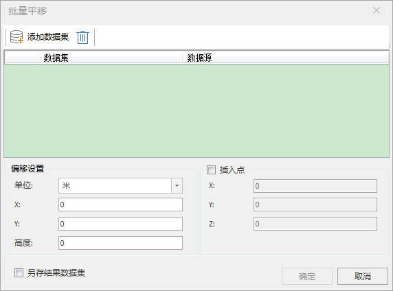

### 使用说明

“批量平移”功能可根据需求对当前场景中的模型进行平移操作，可以是当前场景中的所有模型也可以选择某一部分模型进行平移操作。目前提供两种平移方式，一种是度单位平移：根据经度、纬度、高度偏移值，另一种是米单位平移：根据横轴、纵轴、高度偏移值。

同时，还支持设置插入点。

### 操作步骤

1. 在工作空间管理器中右键单击“数据源”，选择 “打开文件型数据源”，打开包含模型数据集的数据源。
2. 选择模型数据集，右键点击“添加到新球面场景”，在图层管理器中选中模型数据集图层，右键单击“快速定位到本图层”。
3. 单击“ **三维数据** ”选项卡中“ **模型** ”组内的“ **模型工具** ”下拉按钮，在弹出的下拉菜单中选择“批量平移”，弹出“批量平移”对话框，如下图所示。  
     
4. 偏移设置：设置模型批量平移量及单位 
    * 默认平移单位为米。单击“单位”后面的组合框的下拉箭头，可选择“度”作为偏移单位。
    * 当偏移单位为米时，在x、y、高度后的文本框内输入相应数值，x、y、高度三个参数共同确定的模型平移的位置。
    * 当偏移单位为度时，在经度、纬度、高度后的文本框内输入相应数值，经度、纬度和高度三个参数共同确定的模型平移的位置。
5. 插入点；勾选“插入点”，设置批量平移的插入点。设置的插入点与模型位置相对固定，当平移时两者的位置关系不变。
6. 另存结果数据集：若勾选，会在源数据源内生成新的数据集。若不勾选，会覆盖源数据集。默认勾选。
7. 单击" 确定"按钮，执行批量平移操作。单击"取消"按钮，取消执行操作。

### 注意事项

1. 模型批量平移操作执行后，不具有撤销功能。

