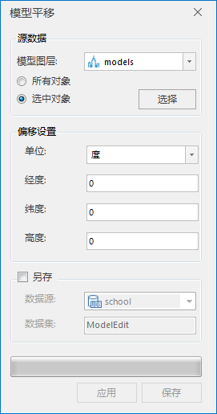
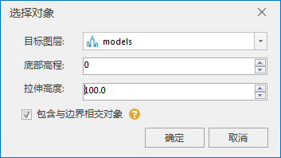
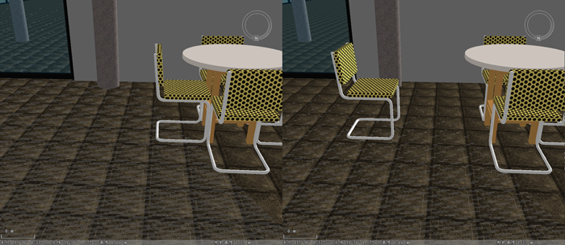

**使用说明**

“模型平移”功能可对选中或全部模型进行平移,支持平面、球面数据。目前提供两种平移方式，一种是度单位平移：根据经度、纬度、高度偏移值，另一种是米单位平移：根据横轴、纵轴、高度偏移值。

模型平移实现了对模型位置的自定义编辑。

### 操作步骤

1. 在工作空间管理器中右键单击“数据源”，选择 “打开文件型数据源”，打开包含模型数据集的数据源。
2. 选择模型数据集，右键点击“添加到新球面场景”，在图层管理器中选中模型数据集图层，右键单击“快速定位到本图层”。
3. 单击“ **三维地理设计** ”选项卡中“ **模型操作** ”组内的“ **模型编辑** ”下拉按钮，在弹出的下拉菜单中选择“模型平移”，弹出“模型平移”对话框，如下图所示:  
  

4. 设置源数据：单击模型图层右侧的组合框下拉箭头，选择需要进行平移操作的模型所在的图层。当需要对模型图层上所有对象进行平移操作，点选"所有对象"，否则点选"选中对象"。 
    * “选中对象”表示只对选中的模型进行平移操作。点选"选中对象"后，单击“选择”按钮，鼠标变为"+"字，在模型图层中用鼠标框选需要平移的模型范围，单击鼠标右键结束选择，弹出“选择对象”对话框，如下图所示。  
    
在“选择对象”对话框内选择“目标图层”，输入“底部高程”和“拉伸高度”数值。自定义是否勾选"包含与边界相交对象"，当勾选“包含与边界相交对象”，表示相交对象参与模型平移；否则，相交对象不参与模型平移。单击“确定”按钮执行对象选择操作，返回“模型平移”对话框。

5. 设置模型偏移参数： 默认偏移单位为度。单击“单位”后面的组合框的下拉箭头，可选择“米”作为偏移单位。
    * 当偏移单位为度时，在经度、纬度、高度后的文本框内输入相应数值，经度、纬度和高度三个参数共同确定的模型平移的位置。
    * 当偏移单位为米时，在x、y、高度后的文本框内输入相应数值，x、y、高度三个参数共同确定的模型平移的位置。
6. 单击“应用”按钮执行模型平移操作，生成临时数据:MultipleModelEdit来存储模型平移后的操作结果。可多次修改模型偏移参数，单击"应用"进行模型平移效果的预览，直至模型平移效果符合自己的需求。模型水平方向平移的示意效果，如下图所示。  
  
  
7. 模型平移结果保存。如果需要覆盖原来的模型数据集，直接单击“保存”按钮进行模型平移结果保存；如果需要另存模型平移结果，勾选"另存"多选框，选择数据源，命名数据集，单击"保存"进行模型平移结果另存操作。

**注意事项**

 1. 当覆盖保存了模型平移后的结果，可以使用Ctrl+Z组合键来撤销保存操作。

 

