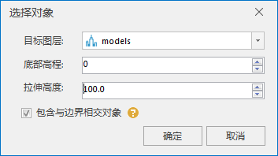

### 使用说明

“模型旋转”功能可对场景中选中或全部模型进行旋转，支持平面、球面数据。目前提供两种旋转方式，一种是以数据集中心点为旋转中心，另一种通过经度和纬度来自定义旋转中心。

### 操作步骤

1. 在工作空间管理器中右键单击“数据源”，选择 “打开文件型数据源”，打开包含模型数据集的数据源。
2. 选择模型数据集，右键点击“添加到新球面场景”，在图层管理器中选中模型数据集图层，右键单击“快速定位到本图层”。
3. 单击“ **三维地理设计** ”选项卡中“ **模型操作** ”组内的“ **模型编辑** ”下拉按钮，在弹出的下拉菜单中选择“模型旋转”，弹出“模型旋转”对话框，如下图所示:  
  
 
4. 设置源数据：单击模型图层右侧的下拉箭头，在下拉框中选择进行旋转操作的模型所在的图层。当需要对模型图层上所有对象进行旋转操作，点选"所有对象"，否则点选"选中对象"。 
    * “选中对象”表示只对选中的模型进行旋转操作。点选"选中对象"后，单击“选择”按钮，鼠标变为"+"字，在模型图层中用鼠标框选旋转模型范围，鼠标右键结束选择，弹出“选择对象”对话框，如下图所示:    
  
 
在“选择对象”对话框内选择“目标图层”，输入“底部高程”和“拉伸高度”数值。自定义是否勾选"包含与边界相交对象"，当勾选“包含与边界相交对象”，表示相交对象参与模型旋转；否则，相交对象不参与模型旋转。单击“确定”按钮执行对象选择操作，返回“模型旋转”对话框。

5. 设置模型旋转参数： 旋转中心点和旋转角度。其中“旋转中心点”默认为数据集中心点，当选择"自定义旋转中心"，单击“拾取”按钮，鼠标变为"+"字，在模型图层中用鼠标点选，实时获取经纬度值并显示在对应文本框内，或者直接输入经度和纬度值来确定旋转中心点。在旋转角度后的输入框内直接输入旋转角度或者使用上下箭头调整旋转角度，从而完成模型旋转的参数设置。
6. 单击“应用”按钮执行模型旋转操作，模型旋转结果存储在MultipleModelEdit临时数据内。支持多次修改模型旋转参数，单击"应用"进行模型旋转效果预览。逆时针旋转30度的示意效果，如下图所示：     
  

7. 保存模型旋转结果。当需要覆盖源模型数据集时，单击“保存”按钮执行操作；当需要另存模型旋转结果时，勾选"另存"多选框，选择数据源并命名数据集，单击"保存"按钮执行模型旋转结果另存操作。

### 注意事项

1. Ctrl+Z组合键能撤销保存操作。

