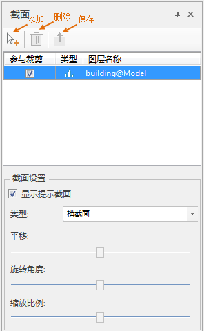
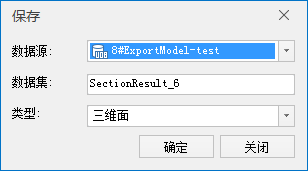
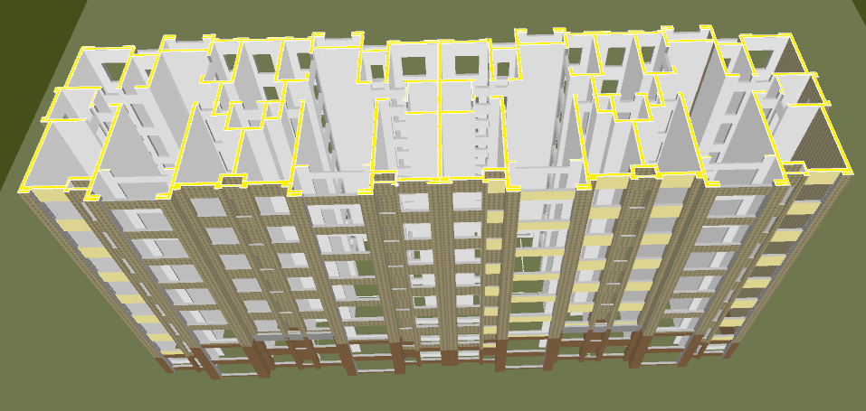

**使用说明**

采用横截面或纵截面对模型数据进行截面提取，一定截面方向能展示出模型的内部构造，提取截面的同时能得到模型截面的二、三维面数据。诸如楼层平面图，机械零部件剖面图等都能使用“获取截面”功能进行实现。

**操作步骤**

  1. 打开包含模型数据集的数据源，将模型数据集添加到球面场景。选中图层管理器中的模型数据集图层，右键单击“快速定位到本图层”。
  2. 单击“ **三维地理设计** ”下的“ **模型操作** ”组的“ **截面与投影** ”下拉按钮，在弹出的下拉菜单中选择“获取截面”按钮，弹出“截面”操作悬浮窗，默认悬浮在窗体右侧。如下图所示：  
  

  3. 勾选需要进行截面裁剪的图层。默认加载并勾选图层管理器中的所有图层。
  4. 截面设置。 
       * 默认勾选“显示提示截面”，则显示截面。取消勾选，则不显示提示截面。
       * 截面类型包含横截面和纵截面。单击类型选择组合框下拉箭头，选择对应的截面类型。默认选择“横截面”。
       * 截面平移、旋转角度和缩放比例通过滑动条进行调整，滑块默认处于中间。
       * 缩放比例可对截面的大小进行调整。
       * 只有选择纵截面类型时旋转角度可用。
  5. 单击“添加”按钮，在场景中鼠标点击截面所在位置，进行截面截取。对截面设置中的平移、旋转角度和缩放比例可以同步进行调整，实时显示获取的截面效果。
  6. 单击“删除”按钮，撤销获取截面操作。
  7. 单击“保存”按钮，导出截面。弹出的“保存”对话框如下图所示：
  
  
  8. 保存截面数据参数设置： 
       * 数据源：设置导出截面数据集存放的数据源。
       * 数据集：数据集名称默认为SectionResult。可自行定义，输入字符串作为导出截面数据集的名称。
       * 类型：可选三维面和二维面。

设置完以上参数，单击“确定”按钮，在指定的结果数据源下生成一个以截图结果数据集名称命名的面数据集。

  9. 获取截面操作成功后，将在指定的结果数据源下生成一个三维矢量面数据集，将该矢量面添加到场景中浏览，图示为对一个模型对象获取截面的操作结果。

   

**注意事项**

  1. 支持多图层同时操作，其中多图层坐标建议保持一致。
  2. 支持SQL查询。

 

