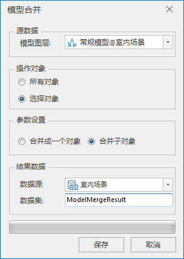

**使用说明**

模型合并包括合并多个对象和合并模型的子对象。BIM模型进行搭建时，把BIM模型合并为一个模型，有效避免操作过程中无意修改尺寸大小，降低BIM模型的质量和搭建效率。

**操作步骤**

  1. 在工作空间管理器中右键单击“数据源”，选择 “打开文件型数据源”，打开包含BIM模型数据集的数据源。
  2. 选择模型数据集，右键点击“添加到新球面场景”，在图层管理器中选中模型图层，右键单击“快速定位到本图层”。
  3. 单击“ **三维地理设计** ”选项卡中“ **模型操作** ”组中" **三角网操作** "下拉按钮，在弹出的下拉菜单中选择“模型合并”，弹出“模型合并”对话框，如下图所示：  
  
  
  4. 源数据选择，确定进行合并的模型对象。鼠标单击“模型图层”组合框的下拉箭头，选择进行模型合并所在的图层。
  5. 操作对象选择：单选模型中需要进行合并操作的对象范围，包括所有对象参与操作和选择对象参与操作。 
       * 所有对象：该图层中所有的模型对象参与模型合并操作。
       * 选择对象：该图层中只有选中的模型对象参与模型合并操作，勾选此项需确保场景中已有模型对象被选中，“鼠标左键+Shift”能在场景中选择多个模型对象。
  6. 参数设置：单选模型合并模式，包括合并成一个对象和合并子对象。 
       * 合并成一个对象：将操作对象合并为一个对象。
       * 合并子对象：将操作对象的子对象进行合并。
  7. 设置结果数据存储相关参数，包括数据源选择和数据集命名。 
       * 数据源：模型合并后的结果模型存储的数据源指定。鼠标单击“数据源”组合框的下拉箭头进行选择。
       * 数据集：结果数据集的名称命名，默认为ModelComposeResult，可自定义数据集名称。
  8. 鼠标单击“保存”按钮，完成模型合并操作。

