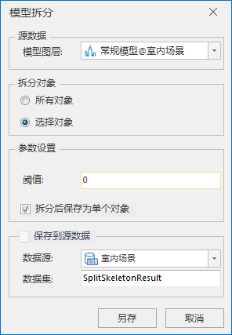

**使用说明**

将全部或选中对象的子对象拆分成多个子对象。在完成BIM模型的搭建后，有时需要对诸如层高、墙厚、板厚、平面布置等反复核查，即需要获得模型对象的子对象。通过BIM子对象拆分可以得到这些构件的尺寸，避免自动拆分后造成预制构件尺寸不对，现场无法组装的情况。

**操作步骤**

  1. 在工作空间管理器中右键单击“数据源”，选择 “打开文件型数据源”，打开包含BIM模型数据集的数据源。
  2. 选择模型数据集，右键点击“添加到新球面场景”，在图层管理器中选中模型图层，右键单击“快速定位到本图层”。
  3. 单击“ **三维地理设计** ”选项卡中“ **模型操作** ”组中“ **三角网操作** ”下拉按钮，在弹出的下拉菜单中选择“模型拆分”，弹出“模型拆分”对话框，如下图所示：  
  

  4. 源数据选择，确定进行模型拆分的模型对象所在的图层。单击“模型图层”组合框的下拉箭头进行选择。
  5. 拆分对象选择，提供“所有对象”和“选择对象”两种拆分对象方式。 
       * 所有对象：该图层中所有的模型对象都进行子对象拆分。
       * 选择对象：该图层中只有选择的模型对象进行子对象拆分。
  6. 参数设置： 
       * 阈值：设置模型拆分的阈值，默认为0，单位为米。模型子对象间距离小于阈值的不进行拆分。
       * 拆分后保存为单个对象：勾选后拆分得到的对象保存为单个对象。
  7. 设置结果数据存储相关参数。模型拆分结果如果需要直接覆盖源数据，勾选“保存到源数据”，否则不勾选。当不勾选“保存到源数据”时，需要进行数据源和数据集设置。 
       * 数据源：模型拆分后的结果模型存储的数据源指定。鼠标单击数据源组合框的下拉箭头进行选择。
       * 数据集：结果数据集的名称命名，默认为SplitSkeletonResult，可自定义数据集名称。
  8. 鼠标单击“另存”按钮，完成模型拆分操作。

**注意事项**

  1. 结果数据设置处，勾选保存到源数据，会修改源数据，需慎重考虑。
  2. 模型拆分不支持多重纹理的数据。
  3. Shift+鼠标左键实现对图层中模型对象的多选。

