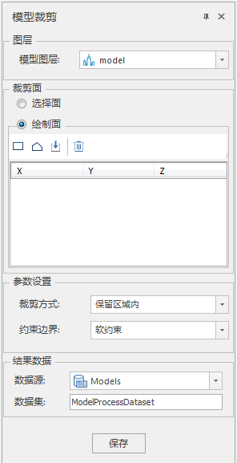

**使用说明**

模型裁剪实现对模型数据集的自定义裁剪，可以选择、绘制或导入面作为裁剪区域。

该方法方便用户根据需求获取特定范围内的模型数据。

**操作步骤**

  1. 在工作空间管理器中右键单击“数据源”，选择“打开文件型数据源”，打开包含模型数据集的数据源。
  2. 选择模型数据集，右键单击“添加到新球面场景”，在图层管理器中选中模型数据集图层，右键单击“快速定位到本图层”。
  3. 单击“ **三维地理设计** ”选项卡中“ **模型操作** ”组中" **三角网操作** "下拉按钮，在弹出的下拉菜单中选择“模型裁剪”，弹出“模型裁剪”面板，如下图所示：  
        
       * 模型图层选择：在图层组中，单击“模型图层”右侧的下拉箭头，选择裁剪对象所在的图层。
       * 裁剪面确定：提供“选择面”和“绘制面”两种裁剪面确定方式。 
         * 当单选"选择面"时，在场景中选择裁剪面对象。
         * 当单选“绘制面”时，选择工具栏中的“矩形”、“多边形”或“导入”工具来绘制特定裁剪面。对于“矩形”和“多边形”工具，鼠标在场景中变为"+"号，单击绘制区域，右键单击结束绘制。对于“导入”工具，会弹出导入对话框，选择面数据集作为裁剪区域，如下图所示。  
  

       * 裁剪参数设置：包括裁剪方式和约束边界。 
          - 单击"裁剪方式"右侧的组合框下拉箭头，在"保留区域内"和"保留区域外"两种裁剪方式中选择一种，其中"保留区域内"裁剪方式是裁剪获取封闭区域内的模型数据集，"保留区域外"裁剪方式是裁剪获取封闭区域外的模型数据集。
          - 单击"约束边界"右侧组合框的下拉箭头，在"软约束"和"硬约束"两种约束方式中选择一种，其中"软约束"是裁剪结果边界高程值和原来一致，保持不变，"硬约束"是裁剪结果边界高程和裁剪面边界高程值一致。

       * 结果数据存储设置：包括数据源和数据集。 
          - 单击“数据源”右侧的组合框下拉箭头，选择裁剪结果存储的数据源。
          - 在“数据集”右侧的文本框内输入裁剪结果存储的文件名。

  4. 单击“保存“执行裁剪结果存储。

**注意事项**

  1. 在绘制裁剪区域时，需要俯视场景，以确保绘制点的准确性。
