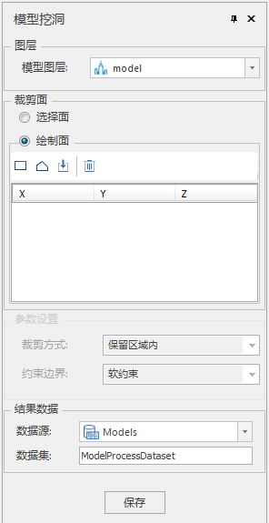
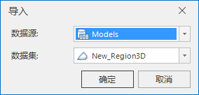

**使用说明**

模型挖洞实现对模型进行区域挖洞，可以选择、绘制或导入面作为挖洞区域。

**操作步骤**

  1. 在工作空间管理器中右键单击“数据源”，选择“打开文件型数据源”，打开包含模型数据集的数据源。
  2. 选择模型数据集，右键单击“添加到新球面场景”，在图层管理器中选中模型数据集图层，右键单击“快速定位到本图层”。
  3. 单击“ **三维地理设计** ”选项卡中“ **模型操作** ”组中" **三角网操作** "下拉按钮，在弹出的下拉菜单中选择“模型挖洞”，弹出“模型挖洞”面板，如下图所示：  
  
       * 模型图层选择：在图层组中，单击“模型图层”右侧的下拉箭头，选择挖洞对象所在的图层。
       * 挖洞面确定：提供“选择面”和“绘制面”两种挖洞面确定方式。 
          - 当单选"选择面"时，在场景中选择挖洞面对象。
          - 当单选“绘制面”时，选择工具栏中的“矩形”、“多边形”或“导入”工具来绘制特定挖洞面。对于“矩形”和“多边形”工具，鼠标在场景中变为"+"号，单击绘制区域，右键单击结束绘制。对于“导入”工具，会弹出导入对话框，选择面数据集作为挖洞区域，如下图所示。  
            

  4. 结果数据存储设置：包括数据源和数据集。   
   单击“数据源”右侧的组合框下拉箭头，选择挖洞结果存储的数据源。  
   在“数据集”右侧的文本框内输入镶挖洞结果存储的文件名。默认为ModelProcessDataset。
  
  5. 单击“保存“执行挖洞结果存储。

