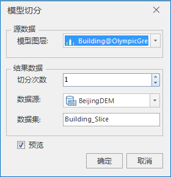

**使用说明**

模型切分功能支持设置切片数量，对模型图层进行切分，切分成对应数量的数据集。

**操作步骤**

1. 在工作空间管理器中右键单击“数据源”，选择“打开文件型数据源”，打开包含模型数据集的数据源。
2. 选择模型数据集，右键单击“添加到新球面场景”，在图层管理器中选中模型数据集图层，右键单击“快速定位到本图层”。
3. 单击“ **三维地理设计** ”选项卡中“ **模型操作** ”组中" **模型切分** "按钮，弹出“模型切分”对话框，如下图所示：  
    

     * 模型图层选择：在图层组中，单击“模型图层”右侧的下拉箭头，选择切分对象所在的图层。
     * 结果数据设置：包括切分次数、数据源和数据集。 

     * 切分次数：模型切分的数量，默认为1，可通过鼠标单击切片次数右侧上下按钮或者直接输入数值等方式调整切分次数。

     * 单击“数据源”右侧的组合框下拉箭头，选择裁剪结果存储的数据源。
     * 在“数据集”右侧的文本框内输入裁剪结果存储的文件名。默认为Building_Slice。

4. 单击“确定“执行裁剪结果存储。
5. 预览：如果需要预览模型切分结果，勾选“预览”复选框，否则不勾选。

**注意事项**

1. 模型切分预览效果的包围面是模型的外接矩形。
2. 模型切分的方向是根据模型数据集的经纬度的大小来确定的，若经度的范围更大时，切分模型数据集的经度方向，反之。

 

