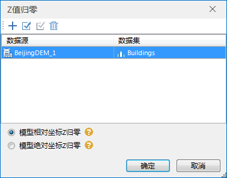

**使用说明**

“坐标归零”功能包括模型相对坐标Z归零和模型绝对坐标Z归零，坐标归零结果均不改变模型的绝对位置。

**操作步骤**

  1. 在工作空间管理器中右键单击“数据源”，选择 “打开文件型数据源”，打开包含模型数据集的数据源。
  2. 选择模型数据集，右键点击“添加到新球面场景”，在图层管理器中选中模型数据集图层，右键单击“快速定位到本图层”。
  3. 单击“ **三维地理设计** ”选项卡中“ **模型操作** ”组内的“ **模型编辑** ”下拉按钮，在弹出的下拉菜单中选择“坐标归零”，弹出“Z值归零”对话框，如下图所示:  
    

  4. 添加进行模型Z值归零的数据集：鼠标单击工具栏中“”图标，选择模型数据集。
  5. 通过工具栏中的“”全选图标或“”反选图标进行数据集选择的批量操作。
  6. 通过工具栏中的“”删除图标删除不操作的数据集。
  7. 确定Z值归零的类型，单选“模型相对坐标Z归零”或“模型绝对坐标Z归零”。 
       * 模型相对坐标Z归零:模型底部中心点Z值归零，差值附加到模型定位点的Z值上。
       * 模型绝对坐标Z归零:模型定位点的Z值设置为0，Z值附加到模型的顶点上。
  8. 单击“确定”按钮，执行模型数据集的Z值归零操作。

 

