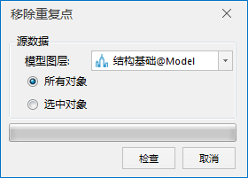
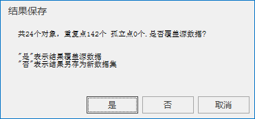
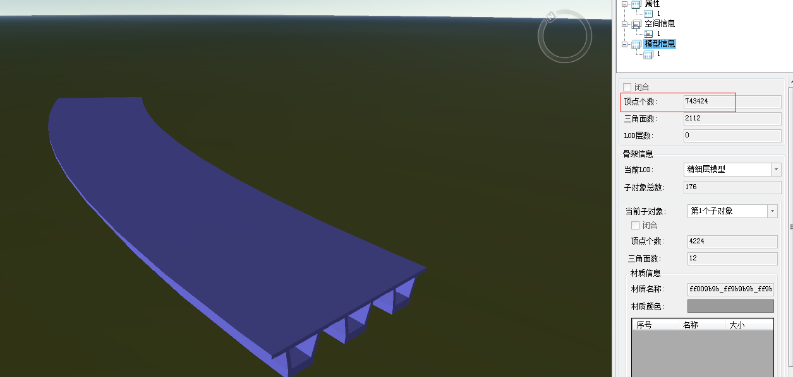
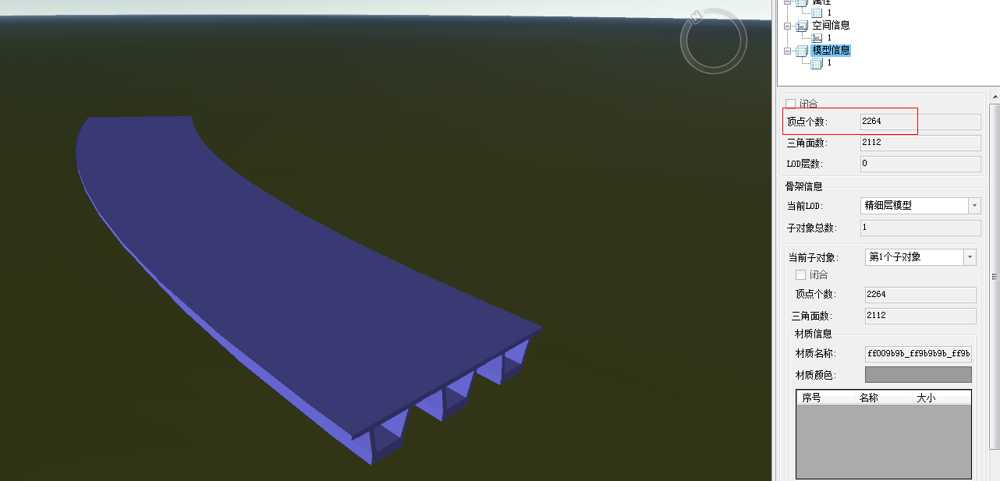

---
id: BIMVertexOperation
title: 移除重复点  
---  
### 使用说明

移除重复点是去除指定图层中选中或全部BIM模型对象的重复点或冗余点，精简模型数据，降低内存的占用，满足大体量数据的性能需要。

### 操作步骤

  1. 在工作空间管理器中右键单击“数据源”，选择 “打开文件型数据源”，打开包含BIM模型数据集的数据源。
  2. 选择需要移除重复点的模型数据集，右键点击“添加到新球面场景”，在图层管理器中选中模型图层，右键单击“快速定位到本图层”。
  3. 单击“ **三维地理设计** ”选项卡中“ **模型操作** ”组中" **三角网操作** "下拉按钮，在弹出的下拉菜单中选择“移除重复点”，弹出如下对话框：   
  

  4. 鼠标单击模型图层组合框的下拉箭头，选择需要移除重复点的模型所在的图层。 单选模型中需要进行重复点移除操作的对象范围，包括所有对象和选中对象。 
      * 所有对象：该图层中所有的模型对象参与移除重复点操作。
      * 选中对象：该图层中只有选中的模型对象参与移除重复点操作。
  5. 鼠标单击“检查”按钮，检查模型对象是否存在重复点。当模型对象中没有重复点，自动关闭“移除重复点”对话框，结束操作。当模型对象中存在重复点，弹出“结果保存”对话框，如下图所示。  
  

  
“结果保存”对话框显示模型检查的相关信息，包括重复点个数。单击“是”，移除重复点的结果覆盖源数据，单击“否”，移除重复点的结果另存为新的数据集。单击“取消”，取消结果保存操作。

  6. 在场景中查看移除重复点模型对象的属性，在模型信息下可以看到顶点个数的改变，如下图所示：       
  
  
  

### 注意事项

  1. Shift+鼠标左键实现对图层中模型对象的多选。
  2. 移除重复点或冗余点的BIM模型对象不支持多重纹理。

