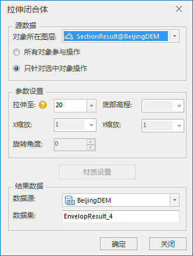

### 使用说明

构建拉伸闭合体功能实现对三维面数据或模型拉伸构建实体模型，构建的拉伸闭合体模型支持布尔运算等空间处理操作。

### 操作步骤

  1. 在工作空间管理器中右键单击“数据源”，打开包含3D面数据集或模型数据集的数据源。将面数据集添加到场景中，并定位到该图层。
  2. 单击“ **三维地理设计** ”选项卡的“ **规则建模** ”组中的“ **规则建模** ”下拉按钮，在下拉菜单中选择“拉伸闭合体”，弹出“拉伸闭合体”对话框。如下图所示：       
  
  3. 源数据的选择 
      * 打开拉伸闭合体功能后，如果当前打开的场景中有多个3D面数据集或模型数据集图层，则需要对“源数据”下“对象所在图层”对应的下拉列表中选择需要操作对象所在的图层；文本框会自动获取最顶端的图层。
      * 当图层中有多个对象时，我们可以选择“所有对象参与操作”或“只针对选中对象操作”。当图层中只有一个对象时，它们功能相同，任选其一。默认选择“只针对选中对象操作”。 
        * 选择该项会将选中图层里的所有三维面和模型对象进行构建拉伸闭合体操作；
        * 用鼠标左键选中单个对象或按住键盘的“Shift”键，配合鼠标左键可选择多个对象。
  4. 参数设置：设置拉伸闭合体对象的拉伸高度，默认值为20，单位为米。
  5. 结果数据的存放 
      * 当工作空间中打开有多个数据源时，需要选择一个数据源存放结果数据。如果只打开了一个数据源，则结果数据默认保存到文本框自动获取的数据源下。
      * 数据集名称：输入字符串作为结果数据集的名称，默认为EnvelopResult。
  6. 点击“确定”按钮，完成拉伸闭合体的构建。在指定的结果数据源下生成一个以数据集名称命名的模型数据集。

### 注意事项

  1. 图层中加载有三维面图层和模型数据集时，拉伸闭合体功能可用。
  2. 如果拉伸高度在面或模型高程最值之间拉伸会失败。

