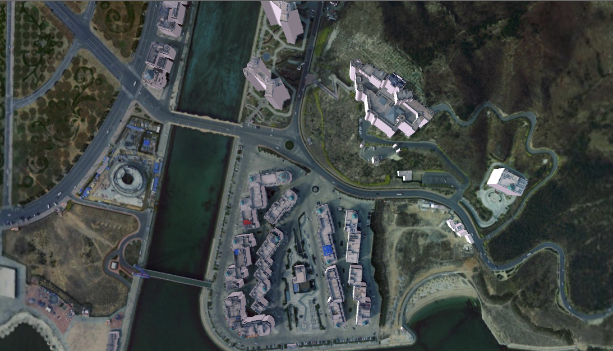

### 使用说明

根据影像数据集及对应的矢量面数据集，提取出矢量面对应的纹理图片，并将纹理路径记录在矢量面数据集相应的字段上。用于矢量面拉伸后设置贴图，使用影像底图出图作为顶面纹理，使构建的模型与影像融合更紧密。

### 操作步骤

  1. 在工作空间管理器中，打开影像数据集和矢量面数据集所在的数据源。
  2. 在“ **三维地理设计** ”选项卡下“ **规则建模** ”组中，单击“ **纹理提取** ”按钮，弹出如下对话框：  
    
  3. 参数设置 
      * 影像数据 
        * 数据源：影像数据集所在的数据源。
        * 数据集：提取纹理所需的影像数据集。
      * 矢量面数据 
        * 数据源：矢量面所在的数据源。
        * 数据集：提取对应区域影像所用的矢量面。
      * 结果设置 
        * 纹理保存字段：提取的纹理保存格式。
        * 纹理输出文件夹：选择提取的纹理保存路径。
  4. 单击“确定”按钮，会在输出路径下保存纹理图片。
  5. 将矢量面加载到场景中，并且设置其风格，拉伸高度，然后进行贴图设置。
  
  6. 在顶部贴图栏，贴图来源就是纹理提取时，选择保存的字段。

效果如下图所示：     

  
---  
  
### 注意事项

  1. 矢量面与影像对应要合理。

