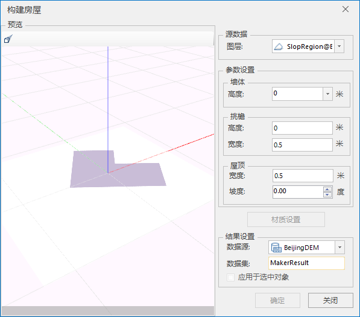
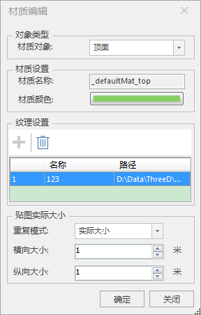
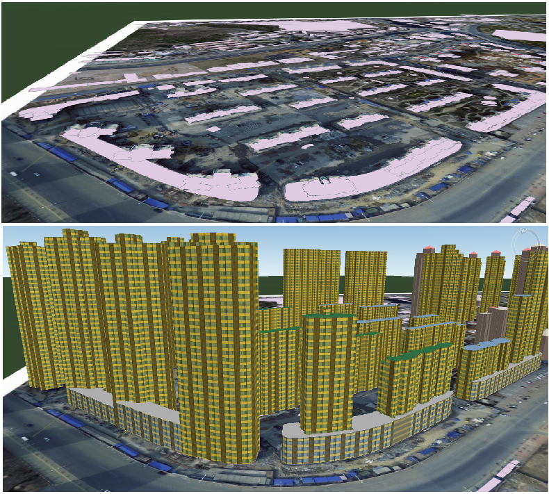

### 使用说明

由多边形构建房屋模型(可构建墙体、挑檐、屋顶)，在预览窗体中设置对象参数和材质后应用到图层或选中对象，起到快速建模的效果。支持二三维面图层（地理坐标系下）

### 操作步骤

  1. 在工作空间管理器中右键单击“数据源”，打开包含2D/3D面数据集的数据源。将面数据集添加到场景中，并定位到该图层。
  2. 在“ **三维地理设计** ”选项卡下的“ **规则建模** ”组中单击“构建房屋”按钮，弹出“构建房屋”对话框。如下图所示：       
  
 
  3. 源数据选择，鼠标单击图层右侧的下拉箭头，在弹出的下拉选项中选择构建房屋所在的图层。
  4. 设置墙体的高度，挑檐的高度与宽度，屋顶的宽度和坡度等参数。
      * 挑檐高度取值范围为-1至1，默认值为0，高度取正值有效。
      * 宽度取值范围为-1至1,默认值为0.5，宽度取0时，挑檐刚好和墙体重合。
      * 屋顶宽度默认值为0.5。
      * 屋顶坡度默认为0，值越大，屋顶越陡峭，取值范围为0至89度。
  5. 设置完房屋的参数后，可对房屋的墙体、挑檐、屋顶设置材质。弹出“材质编辑”对话框，如下所示：  
   
     * 选择材质对象设置其材质颜色、纹理及贴图大小。完成应用后，关闭对话框，可以在“构建房屋”对话框中对构建的房屋模型进行预览。

  6. 结果数据：设置结果数据的存放信息。 
      * 数据源：当工作空间中打开有多个数据源时，选择一个数据源存放结果数据。如果只打开了一个数据源，则结果数据集默认添加到文本框会获取的数据源下。
      * 数据集名称：默认数据集名称为MakerResult。可自行定义，输入字符串作为结果数据集的名称。
  7. 设置完以上参数，点击“应用”按钮，完成房屋的构建。在指定的结果数据源下生成一个与数据集名称命名的模型数据集。

完成房屋的构建后，在场景中打开效果图如下：

   
 
  
### 注意事项

  1. 使用构建房屋功能，需要先打开一个2D/3D面数据集图层。
  2. 屋顶的坡度单位是度。
  3. 墙体的高度、挑檐的高度及屋顶的坡度不同时为0时，材质设置可用。
  4. Shift+鼠标左键对图层中的面对象进行多选。

